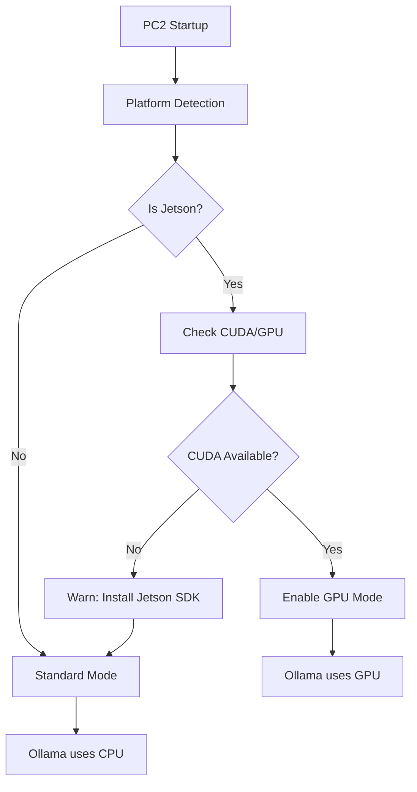

# Jetson SDK Optimization Plan

## Overview

Add modular support for NVIDIA Jetson devices to improve local AI (Ollama) performance through GPU acceleration. The implementation will auto-detect Jetson hardware and enable optimizations only when available.

## Architecture




## Implementation

### 1. Jetson Detection Utility

Create new file: `pc2-node/src/utils/platform.ts`

```typescript
import * as fs from 'fs';
import * as os from 'os';
import { execSync } from 'child_process';

export interface PlatformInfo {
  platform: string;
  arch: string;
  isJetson: boolean;
  jetsonModel?: string;
  cudaAvailable: boolean;
  gpuInfo?: string;
}

export function detectPlatform(): PlatformInfo {
  const platform = os.platform();
  const arch = os.arch();
  
  // Jetson detection: check for Tegra release file
  const isJetson = platform === 'linux' && 
    fs.existsSync('/etc/nv_tegra_release');
  
  let jetsonModel: string | undefined;
  let cudaAvailable = false;
  let gpuInfo: string | undefined;
  
  if (isJetson) {
    // Get Jetson model
    try {
      jetsonModel = fs.readFileSync('/etc/nv_tegra_release', 'utf8')
        .split('\n')[0];
    } catch {}
    
    // Check CUDA availability
    try {
      execSync('nvcc --version', { encoding: 'utf8' });
      cudaAvailable = true;
    } catch {
      cudaAvailable = false;
    }
    
    // Get GPU info
    try {
      gpuInfo = execSync('nvidia-smi --query-gpu=name --format=csv,noheader', 
        { encoding: 'utf8' }).trim();
    } catch {}
  }
  
  return { platform, arch, isJetson, jetsonModel, cudaAvailable, gpuInfo };
}
```

### 2. Update System API Endpoint

Modify: [pc2-node/src/api/system.ts](pc2-node/src/api/system.ts)

Add Jetson info to the `/api/system/info` response:

```typescript
import { detectPlatform } from '../utils/platform';

// In the system info endpoint:
const platformInfo = detectPlatform();

return {
  // existing fields...
  platform: platformInfo.platform,
  arch: platformInfo.arch,
  isJetson: platformInfo.isJetson,
  jetsonModel: platformInfo.jetsonModel,
  cudaAvailable: platformInfo.cudaAvailable,
  gpuInfo: platformInfo.gpuInfo,
};
```

### 3. Update Ollama Status Endpoint

Modify: [pc2-node/src/api/ai.ts](pc2-node/src/api/ai.ts)

Enhance `/api/ai/ollama-status` to show GPU status:

```typescript
router.get('/ollama-status', authenticate, async (req, res) => {
  const platformInfo = detectPlatform();
  
  // Existing Ollama checks...
  
  // Add GPU acceleration status
  let gpuAccelerated = false;
  if (platformInfo.isJetson && platformInfo.cudaAvailable) {
    gpuAccelerated = true;
  }
  
  return res.json({
    installed: ollamaInstalled,
    version: ollamaVersion,
    models: installedModels,
    // New fields
    gpuAccelerated,
    isJetson: platformInfo.isJetson,
    cudaAvailable: platformInfo.cudaAvailable,
    gpuInfo: platformInfo.gpuInfo,
  });
});
```

### 4. Update AI Settings UI

Modify: [src/gui/src/UI/Settings/UITabAIAssistant.js](src/gui/src/UI/Settings/UITabAIAssistant.js)

Show GPU status in the AI settings:

```javascript
// After fetching Ollama status, display GPU info
if (ollamaStatus.isJetson) {
  const gpuStatusEl = document.createElement('div');
  gpuStatusEl.className = 'jetson-gpu-status';
  
  if (ollamaStatus.gpuAccelerated) {
    gpuStatusEl.innerHTML = `
      <span class="status-badge success">GPU Accelerated</span>
      <span class="gpu-info">${ollamaStatus.gpuInfo || 'Jetson GPU'}</span>
    `;
  } else {
    gpuStatusEl.innerHTML = `
      <span class="status-badge warning">CPU Mode</span>
      <span class="hint">Install Jetson SDK for GPU acceleration</span>
    `;
  }
  
  ollamaSection.appendChild(gpuStatusEl);
}
```

### 5. Add Jetson Setup Guide (Optional)

Create new endpoint: `/api/ai/jetson-setup`

Provides instructions for setting up Jetson SDK if detected but not configured:

```typescript
router.get('/jetson-setup', authenticate, async (req, res) => {
  const platformInfo = detectPlatform();
  
  if (!platformInfo.isJetson) {
    return res.json({ applicable: false });
  }
  
  return res.json({
    applicable: true,
    cudaInstalled: platformInfo.cudaAvailable,
    instructions: platformInfo.cudaAvailable ? null : [
      'Install JetPack SDK from NVIDIA',
      'Run: sudo apt install nvidia-jetpack',
      'Restart Ollama: sudo systemctl restart ollama',
    ],
  });
});
```

## Files to Modify


| File                                          | Change                             |
| --------------------------------------------- | ---------------------------------- |
| `pc2-node/src/utils/platform.ts`              | NEW - Platform detection utility   |
| `pc2-node/src/api/system.ts`                  | Add Jetson info to system endpoint |
| `pc2-node/src/api/ai.ts`                      | Add GPU status to Ollama endpoint  |
| `src/gui/src/UI/Settings/UITabAIAssistant.js` | Show GPU status in UI              |


## Why This Works

1. **Modular**: Detection only runs when needed, no impact on non-Jetson
2. **Ollama handles GPU**: Ollama auto-detects CUDA - we just verify and display status
3. **User feedback**: Shows whether GPU is being used
4. **Guidance**: Provides setup instructions if SDK not installed

## Testing

1. On Jetson: Verify detection, GPU status shows correctly
2. On Mac/Linux/Windows: Verify no Jetson UI appears, no errors
3. Verify Ollama performance improvement with GPU vs CPU

## Future Enhancements

- TensorRT integration for custom models
- Automatic Ollama GPU configuration
- Performance metrics display (tokens/sec)

