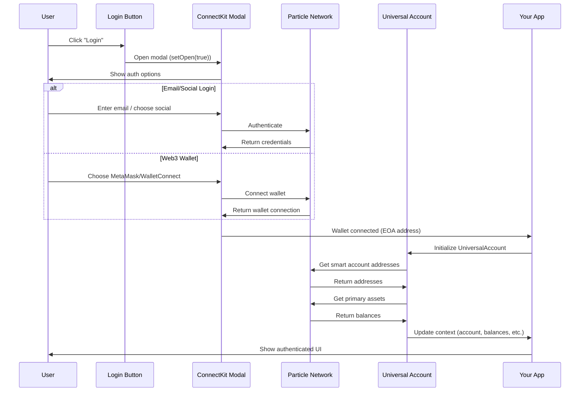

# Particle Network Universal Login - Complete Implementation Guide for PuterOS

**Project:** Elacity Integration with PuterOS  
**Purpose:** Replicate Elacity's Particle Network authentication system for PuterOS app  
**Date:** December 5, 2025  
**Author:** Elacity Engineering Team

---

## Table of Contents

1. [Executive Summary](#executive-summary)
2. [System Architecture Overview](#system-architecture-overview)
3. [Core Dependencies](#core-dependencies)
4. [Environment Configuration](#environment-configuration)
5. [Implementation Steps](#implementation-steps)
6. [Code Structure](#code-structure)
7. [Key Components](#key-components)
8. [Authentication Flow](#authentication-flow)
9. [Integration Points](#integration-points)
10. [Testing Strategy](#testing-strategy)
11. [Security Considerations](#security-considerations)
12. [Troubleshooting](#troubleshooting)
13. [Production Checklist](#production-checklist)

---

## Executive Summary

### What This Document Covers

This guide provides **complete step-by-step instructions** for implementing Particle Network's Universal Login system in a PuterOS application, exactly as implemented in Elacity. After following this guide, your engineer will have:

- ✅ **Multi-chain wallet authentication** (Email, Social, MetaMask, WalletConnect, etc.)
- ✅ **Smart Account support** (ERC-4337 account abstraction)
- ✅ **Universal Account** for cross-chain balance tracking
- ✅ **Production-ready authentication flow**
- ✅ **Same UX as Elacity login**

### Key Features

- **Social Login**: Email, Google, Twitter, Discord authentication
- **Web3 Wallets**: MetaMask, WalletConnect, Coinbase Wallet, Phantom
- **Multi-Chain**: Ethereum, Base, Polygon, Arbitrum, BSC, Solana
- **Smart Accounts**: ERC-4337 compliant with gas abstraction
- **Universal Balances**: Aggregated portfolio across all chains
- **Enhanced RPC**: Particle's infrastructure for token/NFT queries

---

## System Architecture Overview

### High-Level Architecture

```
┌─────────────────────────────────────────────────────────────┐
│                      PuterOS App                            │
├─────────────────────────────────────────────────────────────┤
│                                                             │
│  ┌──────────────────────────────────────────────────────┐  │
│  │      Particle Network Provider Hierarchy             │  │
│  │                                                      │  │
│  │  ParticleConnectkit (ConnectKit UI & Config)       │  │
│  │         ↓                                           │  │
│  │  ParticleNetworkProvider (Core Context)            │  │
│  │         ↓                                           │  │
│  │  - UniversalAccount Instance                       │  │
│  │  - Web3Provider (ethers.js)                        │  │
│  │  - Smart Account Info                              │  │
│  │  - Primary Assets Tracking                         │  │
│  └──────────────────────────────────────────────────────┘  │
│                          ↓                                  │
│  ┌──────────────────────────────────────────────────────┐  │
│  │           Your App Components                        │  │
│  │  - useParticleNetwork() hook                        │  │
│  │  - Login/Logout buttons                             │  │
│  │  - User profile display                             │  │
│  │  - Balance tracking                                 │  │
│  └──────────────────────────────────────────────────────┘  │
└─────────────────────────────────────────────────────────────┘
                          ↓
┌─────────────────────────────────────────────────────────────┐
│             Particle Network Services                       │
├─────────────────────────────────────────────────────────────┤
│  - Authentication (Social, Email, Web3)                    │
│  - Smart Account Management (ERC-4337)                     │
│  - Universal Account (Cross-chain)                         │
│  - Enhanced RPC (Token/NFT queries)                        │
│  - Wallet Connection (MetaMask, WC, etc.)                  │
└─────────────────────────────────────────────────────────────┘
```

### Component Hierarchy

```typescript
<BrowserRouter>
  <ReduxProvider> {/* or your state management */}
    <SnackbarProvider> {/* for notifications */}
      <ParticleNetworkProvider transactionHandler="ua">
        {/* Your App */}
        <App />
      </ParticleNetworkProvider>
    </SnackbarProvider>
  </ReduxProvider>
</BrowserRouter>
```

---

## Core Dependencies

### Required NPM Packages

Add these **exact versions** to your `package.json`:

```json
{
  "dependencies": {
    // Particle Network Core (REQUIRED)
    "@particle-network/connectkit": "^2.1.3",
    "@particle-network/connector-core": "^2.1.0",
    "@particle-network/universal-account-sdk": "^1.0.7",
    
    // Ethereum/Web3 Libraries (REQUIRED)
    "@ethersproject/abi": "^5.6.0",
    "@ethersproject/address": "^5.4.0",
    "@ethersproject/bignumber": "^5.4.2",
    "@ethersproject/bytes": "^5.5.0",
    "@ethersproject/constants": "^5.6.0",
    "@ethersproject/contracts": "^5.6.1",
    "@ethersproject/hash": "^5.4.0",
    "@ethersproject/providers": "^5.6.6",
    "@ethersproject/sha2": "^5.4.0",
    "@ethersproject/strings": "^5.5.0",
    "@ethersproject/units": "^5.6.0",
    "@ethersproject/wallet": "^5.6.1",
    
    // React (if not already installed)
    "react": "^18.3.1",
    "react-dom": "^18.3.1",
    
    // TypeScript (RECOMMENDED)
    "typescript": "~5.6.2",
    
    // State Management (Optional - use your preferred solution)
    "@reduxjs/toolkit": "^2.9.0",
    "react-redux": "^9.1.2",
    
    // Wallet Connect (Optional - for WalletConnect support)
    "@walletconnect/ethereum-provider": "^2.21",
    "@walletconnect/modal": "^2.7.0"
  },
  "devDependencies": {
    "@types/react": "^18.3.0",
    "@types/react-dom": "^18.3.0"
  }
}
```

### Installation Command

```bash
# Using npm
npm install @particle-network/connectkit@^2.1.3 \
  @particle-network/connector-core@^2.1.0 \
  @particle-network/universal-account-sdk@^1.0.7 \
  @ethersproject/abi@^5.6.0 \
  @ethersproject/address@^5.4.0 \
  @ethersproject/bignumber@^5.4.2 \
  @ethersproject/providers@^5.6.6 \
  @ethersproject/units@^5.6.0 \
  @ethersproject/contracts@^5.6.1

# Using yarn (recommended for Elacity compatibility)
yarn add @particle-network/connectkit@^2.1.3 \
  @particle-network/connector-core@^2.1.0 \
  @particle-network/universal-account-sdk@^1.0.7 \
  @ethersproject/abi@^5.6.0 \
  @ethersproject/address@^5.4.0 \
  @ethersproject/bignumber@^5.4.2 \
  @ethersproject/providers@^5.6.6 \
  @ethersproject/units@^5.6.0 \
  @ethersproject/contracts@^5.6.1
```

---

## Environment Configuration

### Step 1: Create Particle Network Project

1. **Go to Particle Network Dashboard**: https://dashboard.particle.network
2. **Sign up/Login** with your account
3. **Create New Project**:
   - Project Name: "PuterOS Authentication"
   - Select chains: Base, Ethereum (add more as needed)
4. **Get Credentials** from project settings:
   - `Project ID`
   - `Client Key`
   - `App ID`

### Step 2: Environment Variables

Create `.env` file in your project root:

```bash
# ============================================
# PARTICLE NETWORK CONFIGURATION (REQUIRED)
# ============================================

# Get these from: https://dashboard.particle.network
REACT_APP_PARTICLE_PROJECT_ID="your-project-id-here"
REACT_APP_PARTICLE_CLIENT_KEY="your-client-key-here"
REACT_APP_PARTICLE_APP_ID="your-app-id-here"

# ============================================
# WALLET CONNECT (OPTIONAL)
# ============================================

# Get from: https://cloud.walletconnect.com/
REACT_APP_WALLETCONNECT_ID="your-walletconnect-project-id"

# ============================================
# TRANSACTION EXECUTOR MODE
# ============================================

# Options:
# - "ua" = Universal Account (Smart Account with ERC-4337)
# - "eoa" = Standard Externally Owned Account
# - "eip1193" = Standard Web3 Provider (legacy)
REACT_APP_TX_EXECUTOR="ua"

# ============================================
# OPTIONAL: ENABLE WEB3 WALLETS
# ============================================

# Set to "true" to enable MetaMask, WalletConnect, etc.
# Set to "false" to only allow social/email login
REACT_APP_ENABLE_WEB3="true"

# ============================================
# BUILD CONFIGURATION
# ============================================

# Your backend API (if applicable)
REACT_APP_BACKEND_URL="https://api.yourapp.com"

# Node environment
NODE_ENV="development"
```

### Environment Variable Details

| Variable | Required | Description | Where to Get |
|----------|----------|-------------|--------------|
| `REACT_APP_PARTICLE_PROJECT_ID` | ✅ Yes | Particle project identifier | Particle Dashboard |
| `REACT_APP_PARTICLE_CLIENT_KEY` | ✅ Yes | Client authentication key | Particle Dashboard |
| `REACT_APP_PARTICLE_APP_ID` | ✅ Yes | Application identifier | Particle Dashboard |
| `REACT_APP_WALLETCONNECT_ID` | ⚠️ Optional | WalletConnect project ID | WalletConnect Cloud |
| `REACT_APP_TX_EXECUTOR` | ✅ Yes | Transaction mode (ua/eoa/eip1193) | Your choice |
| `REACT_APP_ENABLE_WEB3` | ⚠️ Optional | Enable Web3 wallets (default: false) | Your choice |

---

## Implementation Steps

### Step 1: Project Setup (Vite Configuration)

If using **Vite** (recommended), configure for Particle Network WASM support:

**`vite.config.js`**:

```javascript
import { defineConfig, loadEnv } from 'vite';
import path from 'path';
import { readFileSync, existsSync, mkdirSync, copyFileSync } from 'fs';
import react from '@vitejs/plugin-react';
import { nodePolyfills } from 'vite-plugin-node-polyfills';

// Particle Network WASM plugin (for development)
const particleWasmPlugin = {
  name: 'particle-wasm',
  apply: (_, env) => env.mode === 'development',
  buildStart: () => {
    const copiedPath = path.join(
      __dirname,
      'node_modules/@particle-network/thresh-sig/wasm/thresh_sig_wasm_bg.wasm'
    );
    const dir = path.join(__dirname, 'node_modules/.vite/wasm');
    const resultPath = path.join(dir, 'thresh_sig_wasm_bg.wasm');
    if (!existsSync(dir)) {
      mkdirSync(dir, { recursive: true });
    }
    copyFileSync(copiedPath, resultPath);
  },
};

export default defineConfig(({ mode }) => {
  const env = loadEnv(mode, process.cwd(), '');
  
  // Pass REACT_APP_* env vars to the app
  const reactAppEnv = Object.fromEntries(
    Object.entries(env)
      .filter(([key]) => key.match(/^REACT_APP_/))
      .map(([key, value]) => [`process.env.${key}`, JSON.stringify(value)])
  );

  const plugins = [
    react(),
  ];

  // Add node polyfills for production
  if (env.NODE_ENV === 'production') {
    plugins.push(
      nodePolyfills({
        globals: {
          Buffer: true,
          global: true,
          process: true,
        },
      })
    );
  }

  // Add WASM plugin for development
  if (env.NODE_ENV === 'development') {
    plugins.push(particleWasmPlugin);
  }

  return {
    plugins,
    resolve: {
      alias: {
        src: path.resolve(__dirname, 'src'),
      },
    },
    define: {
      ...reactAppEnv,
      'process.env.NODE_ENV': JSON.stringify(env.NODE_ENV),
    },
    server: {
      port: 3000,
      ...(env.NODE_ENV === 'development') && {
        headers: {
          'Cross-Origin-Embedder-Policy': 'require-corp',
          'Cross-Origin-Opener-Policy': 'same-origin',
        },
      },
    },
  };
});
```

### Step 2: Create Core Files Structure

```
src/
├── lib/
│   └── particle-network/
│       ├── index.ts                           # Main exports
│       ├── Provider.tsx                       # Provider wrapper
│       ├── contexts/
│       │   ├── connectkit.tsx                 # ConnectKit configuration
│       │   ├── ParticleNetworkContext.tsx     # Core context
│       │   └── style.css                      # Custom styles
│       ├── hooks/
│       │   └── index.ts                       # Custom hooks
│       ├── components/
│       │   └── ConnectorSelect.tsx            # Login button component
│       └── web3/
│           └── web3-provider.ts               # Web3Provider wrapper
```

### Step 3: Implement Core Files

#### File 1: `src/lib/particle-network/web3/web3-provider.ts`

```typescript
/**
 * Web3Provider - ethers.js wrapper for Particle Network provider
 */
import { Web3Provider as EthersWeb3Provider } from '@ethersproject/providers';

export class Web3Provider extends EthersWeb3Provider {
  constructor(provider: any, network?: any) {
    super(provider, network);
  }
}
```

#### File 2: `src/lib/particle-network/contexts/connectkit.tsx`

```typescript
/**
 * Particle Network ConnectKit Configuration
 * This configures the wallet connection UI and supported chains
 */
import React from 'react';
import {
  ConnectKitProvider,
  createConfig,
  ConnectKitOptions,
} from '@particle-network/connectkit';
import { wallet, EntryPosition } from '@particle-network/connectkit/wallet';
import { base } from '@particle-network/connectkit/chains';
import { authWalletConnectors } from '@particle-network/connectkit/auth';
import {
  evmWalletConnectors,
  walletConnect,
  injected,
} from '@particle-network/connectkit/evm';

// Configure supported chains (add more as needed)
const chains: ConnectKitOptions['chains'] = [
  base, // Base chain (default)
  // Add more chains: ethereum, polygon, arbitrum, etc.
];

// Create ConnectKit configuration
const config = createConfig({
  // Project credentials from environment
  projectId: process.env.REACT_APP_PARTICLE_PROJECT_ID as string,
  clientKey: process.env.REACT_APP_PARTICLE_CLIENT_KEY as string,
  appId: process.env.REACT_APP_PARTICLE_APP_ID as string,

  // UI appearance
  appearance: {
    splitEmailAndPhone: false,
    collapseWalletList: false,
    hideContinueButton: true,
    connectorsOrder: ['email', 'phone', 'social'], // Order of auth methods
    logo: '/your-logo.png', // Your app logo
    language: 'en-US',
    theme: {
      '--pcm-font-family': '-apple-system, "Proxima Nova", Arial, sans-serif',
      '--pcm-accent-color': '#1976d2', // Your brand color
    },
    mode: 'light', // 'light' or 'dark'
  },

  // Wallet connectors
  walletConnectors: [
    // Social/Email authentication
    authWalletConnectors({
      fiatCoin: 'USD',
      promptSettingConfig: {
        promptMasterPasswordSettingWhenLogin: 1,
        promptPaymentPasswordSettingWhenSign: 1,
      },
    }),
    
    // Web3 wallets (MetaMask, WalletConnect, etc.)
    ...(process.env.REACT_APP_ENABLE_WEB3 === 'true'
      ? [
          evmWalletConnectors({
            metadata: { name: 'PuterOS' },
            connectorFns: [
              injected({ target: 'metaMask' }),
              injected({ target: 'phantom' }),
              injected({ target: 'coinbaseWallet' }),
              walletConnect({
                projectId: process.env.REACT_APP_WALLETCONNECT_ID,
              }),
            ],
          }),
        ]
      : []),
  ],

  // Embedded wallet plugin
  plugins: [
    wallet({
      entryPosition: EntryPosition.TR, // Top-right position
      visible: true,
      customStyle: {
        fiatCoin: 'USD',
      },
    }),
  ],

  chains,
} as ConnectKitOptions);

// Context for ConnectKit configuration
export const ParticleConnectkitContext = React.createContext<{ config: any }>({
  config: null,
});

/**
 * ParticleConnectkit Provider
 * Wraps app with ConnectKit configuration
 */
const ParticleConnectkit: React.FC<React.PropsWithChildren> = ({ children }) => {
  return (
    <ParticleConnectkitContext.Provider value={{ config }}>
      <React.Suspense fallback={<></>}>
        <ConnectKitProvider config={config} reconnectOnMount>
          {children}
        </ConnectKitProvider>
      </React.Suspense>
    </ParticleConnectkitContext.Provider>
  );
};

export const useConnectkitConfig = () => React.useContext(ParticleConnectkitContext);

export default React.memo(ParticleConnectkit);
```

#### File 3: `src/lib/particle-network/contexts/ParticleNetworkContext.tsx`

```typescript
/**
 * Particle Network Context
 * Core context providing wallet state and Universal Account
 */
import React from 'react';
import { isAddress } from '@ethersproject/address';
import {
  UniversalAccount,
  IAssetsResponse,
  ISmartAccountOptions,
} from '@particle-network/universal-account-sdk';
import {
  useAccount,
  useDisconnect,
  useWallets,
} from '@particle-network/connectkit';
import { Web3Provider } from '../web3/web3-provider';

// Smart Account Info type
export type SmartAccountInfo = Pick<
  ISmartAccountOptions,
  'ownerAddress' | 'smartAccountAddress' | 'solanaSmartAccountAddress'
>;

// Context value interface
interface ConnectorContextValue {
  account?: string;
  library?: Web3Provider;
  universalAccount?: UniversalAccount;
  smartAccountInfo?: SmartAccountInfo;
  primaryAssets?: IAssetsResponse;
  chainId?: number;
  active?: boolean;
  isConnected?: boolean;
  deactivate: () => void;
  refreshPrimaryAssets?: () => Promise<void>;
  transactionHandler: 'ua' | 'eoa' | 'eip1193';
}

export const ParticleNetworkContext = React.createContext<ConnectorContextValue>({
  transactionHandler: 'eip1193',
  deactivate: () => {},
});

interface ParticleNetworkProviderProps {
  transactionHandler: 'ua' | 'eoa' | 'eip1193';
}

const ParticleNetworkProvider: React.FC<
  React.PropsWithChildren<ParticleNetworkProviderProps>
> = React.memo(({ transactionHandler, children }) => {
  const {
    address: eoaAddress,
    chainId,
    connector,
    isConnected,
  } = useAccount();
  
  const [primaryWallet] = useWallets();
  const { disconnect } = useDisconnect();

  // State
  const [universalAccount, setUniversalAccount] = React.useState<UniversalAccount | null>(null);
  const [primaryAssets, setPrimaryAssets] = React.useState<IAssetsResponse | null>(null);
  const [smartAccountInfo, setSmartAccountInfo] = React.useState<SmartAccountInfo>({
    ownerAddress: '',
    smartAccountAddress: '',
    solanaSmartAccountAddress: '',
  });
  const [particleProvider, setParticleProvider] = React.useState<any>(null);

  // Create Web3Provider from Particle provider
  const library = React.useMemo(
    () => (particleProvider ? new Web3Provider(particleProvider, 'any') : null),
    [particleProvider]
  );

  // Get provider from wallet
  React.useEffect(() => {
    const getProvider = async () => {
      try {
        const provider = await primaryWallet?.connector.getProvider();
        setParticleProvider(provider);
      } catch (error) {
        console.error('Failed to get provider:', error);
      }
    };

    if (eoaAddress && primaryWallet) {
      getProvider();
    }
  }, [primaryWallet, eoaAddress]);

  // Disconnect handler
  const deactivate = React.useCallback(() => {
    disconnect({ connector });
  }, [disconnect, connector]);

  const active = React.useMemo(
    () => !!(eoaAddress && library),
    [library, eoaAddress]
  );

  // Initialize UniversalAccount
  React.useEffect(() => {
    if (transactionHandler === 'ua' && active && eoaAddress) {
      const ua = new UniversalAccount({
        projectId: process.env.REACT_APP_PARTICLE_PROJECT_ID!,
        projectAppUuid: process.env.REACT_APP_PARTICLE_APP_ID!,
        projectClientKey: process.env.REACT_APP_PARTICLE_CLIENT_KEY!,
        ownerAddress: eoaAddress,
      });
      
      console.log('UniversalAccount initialized:', ua);
      setUniversalAccount(ua);
    } else {
      setUniversalAccount(null);
    }
  }, [active, eoaAddress, transactionHandler]);

  // Fetch Smart Account Addresses
  React.useEffect(() => {
    if (universalAccount && eoaAddress) {
      const fetchSmartAccountAddresses = async () => {
        const { smartAccountAddress, solanaSmartAccountAddress } =
          await universalAccount.getSmartAccountOptions();
        
        setSmartAccountInfo({
          ownerAddress: eoaAddress,
          smartAccountAddress: smartAccountAddress || '',
          solanaSmartAccountAddress: solanaSmartAccountAddress || '',
        });
      };

      fetchSmartAccountAddresses();
    }
  }, [universalAccount, eoaAddress]);

  // Fetch Primary Assets
  const fetchPrimaryAssets = React.useCallback(async () => {
    if (!universalAccount || !eoaAddress) return;

    try {
      const assets = await universalAccount.getPrimaryAssets();
      setPrimaryAssets(assets);
    } catch (error) {
      console.warn('Error fetching primary assets:', error);
    }
  }, [universalAccount, eoaAddress]);

  React.useEffect(() => {
    fetchPrimaryAssets();
  }, [fetchPrimaryAssets]);

  // Determine active account (Smart Account or EOA)
  const account =
    transactionHandler === 'ua'
      ? smartAccountInfo?.smartAccountAddress
      : eoaAddress;

  // Context value
  const contextValue = React.useMemo(
    () => ({
      ...(isAddress(account || '')
        ? {
            chainId,
            account,
            library,
            active,
            isConnected,
            connector,
            universalAccount,
            primaryAssets,
            smartAccountInfo,
            refreshPrimaryAssets: fetchPrimaryAssets,
          }
        : {}),
      deactivate,
      transactionHandler,
    }),
    [
      account,
      chainId,
      library,
      active,
      isConnected,
      connector,
      universalAccount,
      primaryAssets,
      smartAccountInfo,
      fetchPrimaryAssets,
      deactivate,
      transactionHandler,
    ]
  );

  return (
    <ParticleNetworkContext.Provider value={contextValue as ConnectorContextValue}>
      {children}
    </ParticleNetworkContext.Provider>
  );
});

ParticleNetworkProvider.displayName = 'ParticleNetworkProvider';

export default ParticleNetworkProvider;
```

#### File 4: `src/lib/particle-network/Provider.tsx`

```typescript
/**
 * Top-level Particle Network Provider
 * Combines ConnectKit and Core Context
 */
import React from 'react';
import ParticleConnectkit from './contexts/connectkit';
import ParticleNetworkProvider from './contexts/ParticleNetworkContext';

interface ConnectorProviderProps {
  transactionHandler: 'ua' | 'eoa' | 'eip1193';
}

const ConnectorProvider: React.FC<React.PropsWithChildren<ConnectorProviderProps>> = ({
  transactionHandler,
  children,
}) => (
  <ParticleConnectkit>
    <ParticleNetworkProvider transactionHandler={transactionHandler}>
      {children}
    </ParticleNetworkProvider>
  </ParticleConnectkit>
);

ConnectorProvider.displayName = 'ParticleNetworkProvider';

export default ConnectorProvider;
```

#### File 5: `src/lib/particle-network/hooks/index.ts`

```typescript
/**
 * Custom hooks for Particle Network
 */
import { useContext } from 'react';
import { ParticleNetworkContext } from '../contexts/ParticleNetworkContext';

export const useParticleNetwork = () => useContext(ParticleNetworkContext);
```

#### File 6: `src/lib/particle-network/components/ConnectorSelect.tsx`

```typescript
/**
 * Login Button Component
 * Opens Particle Network authentication modal
 */
import React from 'react';
import { useModal } from '@particle-network/connectkit';
import { useParticleNetwork } from '../hooks';

export default function ConnectorSelect() {
  const { account, deactivate } = useParticleNetwork();
  const { setOpen } = useModal();

  const handleClick = () => {
    if (account) {
      // Already connected - disconnect
      deactivate();
    } else {
      // Not connected - open login modal
      setOpen(true);
    }
  };

  return (
    <button
      onClick={handleClick}
      style={{
        padding: '10px 20px',
        borderRadius: '8px',
        border: 'none',
        backgroundColor: '#1976d2',
        color: 'white',
        cursor: 'pointer',
        fontSize: '16px',
      }}
    >
      {account ? 'Disconnect' : 'Login'}
    </button>
  );
}
```

#### File 7: `src/lib/particle-network/index.ts`

```typescript
/**
 * Main exports for Particle Network
 */
export { default as ParticleNetworkProvider } from './Provider';
export { default as ConnectorSelect } from './components/ConnectorSelect';
export * from './contexts/ParticleNetworkContext';
export * from './hooks';
export * from './contexts/connectkit';
```

### Step 4: Integrate into Your App

#### File: `src/App.tsx` (or your main app component)

```typescript
import React from 'react';
import { BrowserRouter } from 'react-router-dom';
import { ParticleNetworkProvider, ConnectorSelect, useParticleNetwork } from './lib/particle-network';

// Example component using Particle Network
function UserProfile() {
  const { account, primaryAssets, active, smartAccountInfo } = useParticleNetwork();

  if (!active) {
    return <div>Not connected</div>;
  }

  return (
    <div>
      <h2>User Profile</h2>
      <p><strong>Account:</strong> {account}</p>
      <p><strong>EOA Address:</strong> {smartAccountInfo?.ownerAddress}</p>
      <p><strong>Smart Account:</strong> {smartAccountInfo?.smartAccountAddress}</p>
      <p><strong>Total Balance:</strong> ${primaryAssets?.totalAmountInUSD || '0.00'}</p>
    </div>
  );
}

function App() {
  return (
    <BrowserRouter>
      <ParticleNetworkProvider 
        transactionHandler={process.env.REACT_APP_TX_EXECUTOR as 'ua' | 'eoa' | 'eip1193'}
      >
        <div style={{ padding: '20px' }}>
          <header>
            <h1>PuterOS App</h1>
            <ConnectorSelect />
          </header>
          
          <main>
            <UserProfile />
          </main>
        </div>
      </ParticleNetworkProvider>
    </BrowserRouter>
  );
}

export default App;
```

---

## Authentication Flow

### User Login Flow



### What Happens on Login

1. **User clicks "Login" button** → ConnectKit modal opens
2. **User selects auth method**:
   - Email → Enter email, receive code
   - Google → OAuth flow
   - MetaMask → Browser extension connection
   - WalletConnect → QR code scan
3. **Particle authenticates** → Returns wallet provider
4. **App initializes UniversalAccount** (if `TX_EXECUTOR=ua`)
5. **Fetches smart account addresses** (EVM + Solana)
6. **Fetches primary assets** (cross-chain balances)
7. **Context updates** → All components re-render with wallet data
8. **User is logged in** ✅

---

## Integration Points

### Accessing Wallet Data

```typescript
import { useParticleNetwork } from './lib/particle-network';

function MyComponent() {
  const {
    account,              // Current account address (Smart Account or EOA)
    active,               // Is wallet connected?
    chainId,              // Current chain ID
    library,              // ethers.js Web3Provider
    primaryAssets,        // Cross-chain balance data
    universalAccount,     // UniversalAccount instance
    smartAccountInfo,     // Smart account addresses
    deactivate,           // Disconnect function
    refreshPrimaryAssets, // Refresh balances
  } = useParticleNetwork();

  if (!active) {
    return <div>Please connect wallet</div>;
  }

  return (
    <div>
      <p>Address: {account}</p>
      <p>Chain: {chainId}</p>
      <p>Balance: ${primaryAssets?.totalAmountInUSD}</p>
      <button onClick={deactivate}>Logout</button>
    </div>
  );
}
```

### Reading Blockchain Data

```typescript
import { useParticleNetwork } from './lib/particle-network';

function TokenBalance() {
  const { library, account } = useParticleNetwork();
  const [balance, setBalance] = React.useState('0');

  React.useEffect(() => {
    if (!library || !account) return;

    // Get ETH balance
    library.getBalance(account).then((bal) => {
      setBalance(ethers.utils.formatEther(bal));
    });
  }, [library, account]);

  return <div>ETH Balance: {balance}</div>;
}
```

### Sending Transactions

```typescript
import { useParticleNetwork } from './lib/particle-network';
import { ethers } from 'ethers';

function SendTransaction() {
  const { library, account, universalAccount, transactionHandler } = useParticleNetwork();

  const sendETH = async () => {
    if (transactionHandler === 'ua' && universalAccount) {
      // Use Universal Account (gasless transaction)
      const tx = await universalAccount.sendTransaction({
        to: '0xRecipientAddress',
        value: ethers.utils.parseEther('0.01').toString(),
      });
      console.log('Transaction sent:', tx);
    } else if (library) {
      // Standard EOA transaction
      const signer = library.getSigner();
      const tx = await signer.sendTransaction({
        to: '0xRecipientAddress',
        value: ethers.utils.parseEther('0.01'),
      });
      await tx.wait();
      console.log('Transaction confirmed:', tx);
    }
  };

  return <button onClick={sendETH}>Send 0.01 ETH</button>;
}
```

---

## Testing Strategy

### Manual Testing Checklist

- [ ] **Email login works** - User can authenticate with email
- [ ] **Google login works** - OAuth flow completes successfully
- [ ] **MetaMask login works** - Browser extension connects
- [ ] **WalletConnect works** - Mobile wallet scanning works
- [ ] **Account displays correctly** - Address shown in UI
- [ ] **Balance loads** - Primary assets fetch successfully
- [ ] **Smart Account initialized** - Smart account address present (if `TX_EXECUTOR=ua`)
- [ ] **Disconnect works** - Logout clears state
- [ ] **Reconnection works** - Page reload preserves session
- [ ] **Multi-chain support** - Can switch networks

### Automated Testing (Jest Example)

```typescript
// Mock Particle Network for testing
jest.mock('./lib/particle-network', () => ({
  useParticleNetwork: () => ({
    account: '0x1234567890123456789012345678901234567890',
    active: true,
    chainId: 8453, // Base
    library: mockWeb3Provider,
    primaryAssets: { totalAmountInUSD: '100.50' },
    deactivate: jest.fn(),
  }),
}));

test('displays user account when connected', () => {
  render(<UserProfile />);
  expect(screen.getByText(/0x1234567890/)).toBeInTheDocument();
});
```

---

## Security Considerations

### Critical Security Rules

1. **NEVER commit `.env` file** to version control
2. **Store credentials securely** in environment variables
3. **Use HTTPS in production** - Required for wallet connections
4. **Validate all user inputs** before blockchain transactions
5. **Never expose private keys** - Particle handles this
6. **Implement transaction limits** - Prevent abuse
7. **Use Content Security Policy** headers
8. **Monitor for suspicious activity** via Sentry or similar

### Production Security Checklist

- [ ] Environment variables stored in secure vault (Vercel, Netlify, etc.)
- [ ] HTTPS enabled on production domain
- [ ] CSP headers configured
- [ ] Rate limiting on backend APIs
- [ ] Transaction amount limits enforced
- [ ] Error monitoring (Sentry) configured
- [ ] Wallet connection requires user approval
- [ ] No private keys stored in frontend
- [ ] Regular security audits scheduled

---

## Troubleshooting

### Common Issues & Solutions

#### Issue 1: "Failed to initialize Particle Network"

**Cause**: Missing or invalid environment variables

**Solution**:
```bash
# Verify all required env vars are set
echo $REACT_APP_PARTICLE_PROJECT_ID
echo $REACT_APP_PARTICLE_CLIENT_KEY
echo $REACT_APP_PARTICLE_APP_ID

# Check Particle Dashboard for correct values
```

#### Issue 2: "Wallet not connecting"

**Cause**: Browser blocking popups or wrong network

**Solution**:
- Allow popups from your domain
- Check browser console for errors
- Try incognito mode to rule out extensions
- Verify chain configuration in ConnectKit

#### Issue 3: "Balance showing $0.00"

**Cause**: UniversalAccount not initialized or API error

**Solution**:
```typescript
// Check if UA initialized
console.log('UA instance:', universalAccount);

// Manually refresh
await refreshPrimaryAssets();

// Check TX_EXECUTOR mode
console.log('TX Handler:', transactionHandler);
```

#### Issue 4: "Build errors with WASM"

**Cause**: Particle WASM files not copied correctly

**Solution**:
- Ensure `particleWasmPlugin` in `vite.config.js`
- Clear `node_modules/.vite` and rebuild
- Check file permissions on WASM directory

#### Issue 5: "MetaMask not showing in wallet list"

**Cause**: `REACT_APP_ENABLE_WEB3` not set to "true"

**Solution**:
```bash
# In .env
REACT_APP_ENABLE_WEB3="true"
```

---

## Production Checklist

### Pre-Launch Requirements

#### 1. Configuration
- [ ] Production Particle Network project created
- [ ] Production environment variables set
- [ ] WalletConnect project ID configured
- [ ] Supported chains configured correctly
- [ ] Logo and branding assets uploaded

#### 2. Testing
- [ ] All authentication methods tested
- [ ] Transaction flows verified
- [ ] Multi-device testing (desktop, mobile, tablet)
- [ ] Cross-browser testing (Chrome, Firefox, Safari, Edge)
- [ ] Network switching tested
- [ ] Disconnect/reconnect flows verified

#### 3. Security
- [ ] No secrets in codebase
- [ ] HTTPS enforced
- [ ] CSP headers configured
- [ ] Error boundaries implemented
- [ ] Rate limiting configured
- [ ] Security audit completed

#### 4. Performance
- [ ] Bundle size optimized
- [ ] Lazy loading implemented
- [ ] WASM files served efficiently
- [ ] CDN configured for static assets
- [ ] Load time < 3 seconds

#### 5. Monitoring
- [ ] Error tracking (Sentry) configured
- [ ] Analytics events tracked
- [ ] Transaction monitoring enabled
- [ ] User authentication metrics tracked
- [ ] Performance monitoring active

#### 6. Documentation
- [ ] Internal docs updated
- [ ] User guides written
- [ ] API documentation complete
- [ ] Troubleshooting guide available
- [ ] Support team trained

---

## Additional Resources

### Official Documentation

- **Particle Network Docs**: https://docs.particle.network
- **Particle Dashboard**: https://dashboard.particle.network
- **ConnectKit Guide**: https://docs.particle.network/developers/connectkit
- **Universal Account API**: https://docs.particle.network/developers/universal-account
- **ERC-4337 Standard**: https://eips.ethereum.org/EIPS/eip-4337

### Elacity Reference Files

Refer to these files in the Elacity codebase for real-world implementation:

- `src/lib/particle-network/contexts/connectkit.tsx` - ConnectKit configuration
- `src/lib/particle-network/contexts/ParticleNetworkContext.tsx` - Core context
- `src/lib/particle-network/Provider.tsx` - Provider wrapper
- `src/provider/index.tsx` - App-level integration
- `docs/wiki/Technical/Particle-Network.md` - Internal documentation
- `vite.config.js` - Build configuration
- `.env.example` - Environment variable template

### Support Channels

- **Particle Network Discord**: https://discord.gg/particle-network
- **Particle Network Support**: support@particle.network
- **Elacity Team**: For questions about this implementation

---

## Summary

You now have **everything** needed to implement Particle Network Universal Login in PuterOS:

✅ **Complete code files** ready to copy-paste  
✅ **Environment configuration** with all required variables  
✅ **Build setup** (Vite) with WASM support  
✅ **Authentication flow** fully documented  
✅ **Testing strategy** with examples  
✅ **Security guidelines** and production checklist  
✅ **Troubleshooting** for common issues  

### Next Steps

1. **Install dependencies** from package.json
2. **Create environment file** with Particle credentials
3. **Copy code files** to your project
4. **Configure Vite** with WASM plugin
5. **Integrate provider** at app root
6. **Add login button** to your UI
7. **Test authentication** flows
8. **Deploy to staging** for QA
9. **Launch to production** 🚀

### Questions?

If your engineer has questions during implementation:
- Check Particle Network documentation
- Review Elacity reference files
- Contact Particle Network support
- Reach out to Elacity team

**Good luck with your integration!** 🎉

---

**Document Version:** 1.0  
**Last Updated:** December 5, 2025  
**Maintained By:** Elacity Engineering Team
