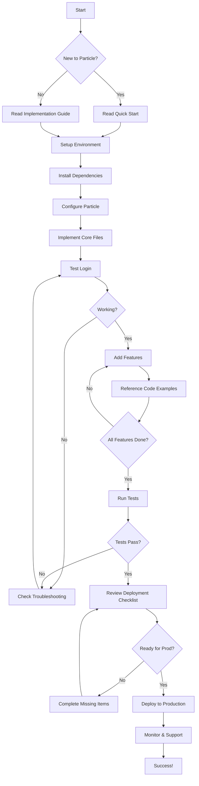

# Particle Network Integration - Documentation Index

**Complete guide for implementing Elacity's authentication system in PuterOS**

---

## 📚 Documentation Overview

This documentation package provides **everything** your engineer needs to implement the exact same Particle Network Universal Login system used in Elacity.

### What's Included

| Document | Purpose | Read Time | Audience |
|----------|---------|-----------|----------|
| **[Quick Start Guide](./PARTICLE_NETWORK_QUICK_START.md)** | 30-minute setup | 5 min | Engineers (new to Particle) |
| **[Implementation Guide](./PARTICLE_NETWORK_IMPLEMENTATION_GUIDE.md)** | Complete technical reference | 30 min | All engineers |
| **[Code Examples](./PARTICLE_CODE_EXAMPLES.md)** | Ready-to-use code snippets | 15 min | Engineers (implementation) |
| **[Deployment Checklist](./PARTICLE_DEPLOYMENT_CHECKLIST.md)** | Production launch guide | 10 min | DevOps/Lead Engineers |
| **[Environment Template](./PARTICLE_ENV_TEMPLATE.env)** | Environment variable reference | 2 min | All engineers |

---

## 🚀 Getting Started (Choose Your Path)

### Path 1: "I need this working NOW" (30 minutes)

**For engineers who need a quick proof-of-concept:**

1. Read: [Quick Start Guide](./PARTICLE_NETWORK_QUICK_START.md)
2. Copy: Environment template
3. Follow: 5-step setup
4. Test: Login works!

**Result:** Working authentication in 30 minutes

---

### Path 2: "I want to understand everything" (2 hours)

**For engineers building production systems:**

1. **Phase 1 - Understanding (30 min)**
   - Read: [Implementation Guide](./PARTICLE_NETWORK_IMPLEMENTATION_GUIDE.md) → Sections 1-4
   - Understand: Architecture, dependencies, configuration

2. **Phase 2 - Implementation (60 min)**
   - Follow: [Implementation Guide](./PARTICLE_NETWORK_IMPLEMENTATION_GUIDE.md) → Steps 1-4
   - Reference: [Code Examples](./PARTICLE_CODE_EXAMPLES.md)
   - Build: Core authentication system

3. **Phase 3 - Testing (30 min)**
   - Test: All authentication methods
   - Verify: Balance display, transactions
   - Debug: Any issues using troubleshooting section

**Result:** Production-ready authentication system

---

### Path 3: "I'm ready to deploy" (1 hour)

**For engineers launching to production:**

1. **Pre-Launch Review (20 min)**
   - Review: [Deployment Checklist](./PARTICLE_DEPLOYMENT_CHECKLIST.md)
   - Verify: All checkboxes complete
   - Test: Staging environment

2. **Deployment (20 min)**
   - Configure: Production environment
   - Deploy: To hosting platform
   - Verify: Production site working

3. **Post-Launch Monitoring (20 min)**
   - Monitor: Error rates, performance
   - Verify: User logins successful
   - Support: Ready for user issues

**Result:** Live production system ✅

---

## 📖 Document Details

### 1. Quick Start Guide
**File:** `PARTICLE_NETWORK_QUICK_START.md`  
**Purpose:** Fast-track implementation for experienced engineers  
**Contains:**
- 5-step setup process
- Minimal code examples
- Quick troubleshooting
- 30-minute timeline

**When to use:** First-time setup, proof of concept, rapid prototyping

---

### 2. Implementation Guide (Primary Reference)
**File:** `PARTICLE_NETWORK_IMPLEMENTATION_GUIDE.md`  
**Purpose:** Complete technical documentation  
**Contains:**
- System architecture
- Complete dependency list
- Environment configuration
- Step-by-step implementation
- Full code files (copy-paste ready)
- Testing strategy
- Security guidelines
- Troubleshooting
- Production checklist

**When to use:** Main reference for all implementation work

**Sections:**
1. **Executive Summary** - High-level overview
2. **System Architecture** - How everything fits together
3. **Core Dependencies** - What to install
4. **Environment Configuration** - Credentials and setup
5. **Implementation Steps** - Step-by-step code
6. **Authentication Flow** - How login works
7. **Integration Points** - Using in your app
8. **Testing Strategy** - Verification steps
9. **Security Considerations** - Critical security rules
10. **Troubleshooting** - Common issues and fixes
11. **Production Checklist** - Pre-launch requirements

---

### 3. Code Examples
**File:** `PARTICLE_CODE_EXAMPLES.md`  
**Purpose:** Ready-to-use code snippets  
**Contains:**
- Login/Logout examples
- User profile display
- Balance queries
- Transaction sending
- Contract interactions
- Network switching
- Error handling
- Complete app example

**When to use:** During implementation when you need specific functionality

**Categories:**
- ✅ Basic Setup
- ✅ Authentication
- ✅ Profile Display
- ✅ Balance Management
- ✅ Transactions (Native + ERC-20)
- ✅ Smart Contracts (Read/Write)
- ✅ Network Switching
- ✅ Error Handling
- ✅ Complete App

---

### 4. Deployment Checklist
**File:** `PARTICLE_DEPLOYMENT_CHECKLIST.md`  
**Purpose:** Production launch guide  
**Contains:**
- Pre-deployment checklist (10 sections)
- Deployment day checklist
- Environment setup guides
- Performance benchmarks
- Rollback procedures
- Support readiness
- Success criteria

**When to use:** Before launching to production

**Sections:**
1. Particle Network Configuration
2. Environment Variables
3. Code Quality
4. Testing (Unit, Integration, Browser, Device)
5. Security
6. Performance
7. Monitoring & Analytics
8. User Experience
9. Documentation
10. Legal & Compliance

---

### 5. Environment Template
**File:** `PARTICLE_ENV_TEMPLATE.env`  
**Purpose:** Reference for required environment variables  
**Contains:**
- All required variables
- Detailed comments
- Configuration options
- Security notes

**When to use:** Creating `.env` file for any environment

---

## 🎯 Use Cases & Document Mapping

### Use Case 1: "First time setting up Particle Network"

**Documents to read:**
1. Quick Start Guide → Get it working fast
2. Implementation Guide → Understand architecture
3. Code Examples → Reference during coding

**Estimated time:** 1-2 hours

---

### Use Case 2: "Need specific feature (e.g., send transaction)"

**Documents to read:**
1. Code Examples → Find "Send Transactions" section
2. Implementation Guide → Reference if issues

**Estimated time:** 15 minutes

---

### Use Case 3: "Troubleshooting login issues"

**Documents to read:**
1. Implementation Guide → Troubleshooting section
2. Quick Start → Common Issues table

**Estimated time:** 10 minutes

---

### Use Case 4: "Preparing for production launch"

**Documents to read:**
1. Deployment Checklist → Complete all sections
2. Implementation Guide → Security Considerations
3. Implementation Guide → Production Checklist

**Estimated time:** 2-3 hours (includes testing)

---

## 🛠️ Implementation Workflow



---

## 📋 Pre-Implementation Checklist

Before you start, make sure you have:

- [ ] **Node.js 20.18+** installed
- [ ] **Package manager** (npm or yarn)
- [ ] **Git** for version control
- [ ] **Code editor** (VS Code recommended)
- [ ] **Particle Network account** (create at dashboard.particle.network)
- [ ] **Basic React knowledge**
- [ ] **Basic TypeScript knowledge** (recommended)
- [ ] **Basic blockchain knowledge** (helpful but not required)

---

## 🆘 Getting Help

### Documentation Issues

If something in the documentation is unclear:
1. Check the troubleshooting section in Implementation Guide
2. Review related code examples
3. Search Particle Network docs: https://docs.particle.network

### Implementation Issues

If you encounter technical problems:
1. **Environment Issues** → Check Environment Template
2. **Code Errors** → Compare with Code Examples
3. **Build Errors** → Review Implementation Guide Step 1 (Vite Config)
4. **Runtime Errors** → Check Troubleshooting section
5. **Authentication Failures** → Verify credentials in Particle Dashboard

### External Support

- **Particle Network Docs:** https://docs.particle.network
- **Particle Dashboard:** https://dashboard.particle.network
- **Particle Discord:** https://discord.gg/particle-network
- **Particle Support:** support@particle.network

### Elacity Reference

All documentation is based on the actual Elacity implementation:
- **Source Files:** `src/lib/particle-network/` in Elacity repo
- **Technical Docs:** `docs/wiki/Technical/Particle-Network.md`
- **Configuration:** `vite.config.js`, `.env.example`

---

## 📊 Success Metrics

After implementation, you should be able to:

- ✅ **Login with email** in < 30 seconds
- ✅ **Login with Google** via OAuth
- ✅ **Connect MetaMask** (if Web3 enabled)
- ✅ **Display user wallet address**
- ✅ **Show portfolio balance** (if Universal Account enabled)
- ✅ **Send transactions** (ETH or ERC-20 tokens)
- ✅ **Handle errors gracefully**
- ✅ **Persist session** across page reloads
- ✅ **Logout and clear state**

If all these work → **Implementation successful!** 🎉

---

## 🔄 Document Updates

### Version History

- **v1.0** (Dec 5, 2025) - Initial release
  - Complete implementation guide
  - Code examples
  - Deployment checklist
  - Quick start guide
  - Environment template

### Maintenance

These documents are maintained by the Elacity engineering team.

**To request updates:**
- Report issues with examples
- Suggest improvements
- Request additional use cases

---

## 📝 Quick Reference Card

### Essential Commands

```bash
# Install dependencies
npm install @particle-network/connectkit@^2.1.3 \
  @particle-network/connector-core@^2.1.0 \
  @particle-network/universal-account-sdk@^1.0.7

# Start development server
npm run dev

# Build for production
npm run build

# Run tests
npm test
```

### Essential Imports

```typescript
// Main provider
import { ParticleNetworkProvider } from './lib/particle-network';

// Login button
import { ConnectorSelect } from './lib/particle-network';

// Access wallet data
import { useParticleNetwork } from './lib/particle-network';

// Modal control
import { useModal } from '@particle-network/connectkit';
```

### Essential Environment Variables

```bash
REACT_APP_PARTICLE_PROJECT_ID="..."
REACT_APP_PARTICLE_CLIENT_KEY="..."
REACT_APP_PARTICLE_APP_ID="..."
REACT_APP_TX_EXECUTOR="ua"
```

---

## 🎓 Learning Path

### Beginner (No Particle Experience)

**Day 1:**
1. Read Quick Start Guide (30 min)
2. Set up environment (30 min)
3. Test basic login (30 min)

**Day 2:**
1. Read Implementation Guide - Architecture (1 hour)
2. Understand authentication flow (30 min)
3. Explore code examples (30 min)

**Day 3:**
1. Implement features from examples (2 hours)
2. Test all authentication methods (1 hour)

**Total Time:** ~7 hours

### Intermediate (Some Web3 Experience)

**Session 1 (2 hours):**
1. Quick Start Guide → Working login
2. Code Examples → Add features
3. Test thoroughly

**Session 2 (1 hour):**
1. Review Implementation Guide
2. Optimize implementation
3. Add error handling

**Total Time:** ~3 hours

### Advanced (Production Deployment)

**Phase 1 (1 hour):**
1. Implementation Guide → Full read
2. Deployment Checklist → Review all sections

**Phase 2 (2 hours):**
1. Complete deployment checklist
2. Set up monitoring
3. Deploy to production

**Total Time:** ~3 hours

---

## ✨ What Makes This Guide Special

Unlike typical integration guides, this documentation provides:

✅ **Real Production Code** - Based on live Elacity implementation  
✅ **Complete Examples** - Copy-paste ready code that works  
✅ **Multiple Learning Paths** - Choose based on your needs  
✅ **Troubleshooting** - Real issues with real solutions  
✅ **Production Ready** - Deployment checklist included  
✅ **Security First** - Best practices throughout  
✅ **Maintained** - Updated as Elacity evolves  

---

## 🎯 Next Steps

**Ready to start?**

1. **Choose your path** (Quick Start vs Full Implementation)
2. **Open the relevant document**
3. **Follow the steps**
4. **Build something amazing!** 🚀

**Questions?** Start with the Implementation Guide's troubleshooting section.

**Stuck?** Check Code Examples for similar use cases.

**Ready to deploy?** Review Deployment Checklist.

---

**Happy coding!** 💻

*From the Elacity Engineering Team*

---

**Document Version:** 1.0  
**Last Updated:** December 5, 2025  
**Maintained By:** Elacity Engineering
