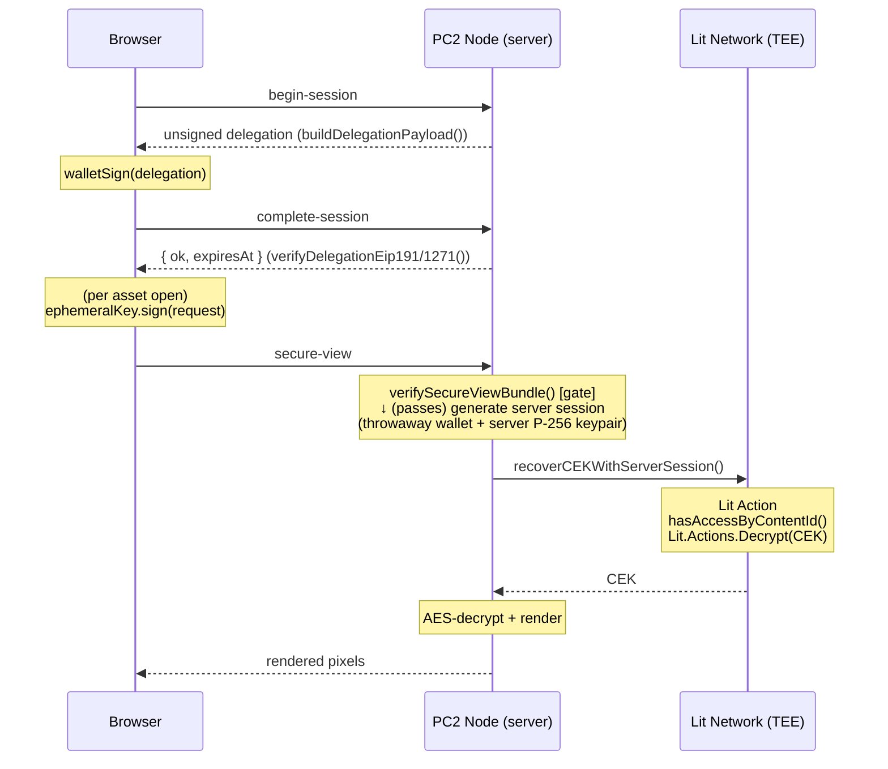

# dDRM Secure-View Decryption Audit — Non-Media Assets

**Date:** 2026-05-20  
**Scope:** `/api/storage/lit/secure-view` and the full session-key delegation (Option C) workflow  
**Format:** Findings only — no code changes.

---

## 1. System Overview

The secure-view pipeline keeps raw file bytes entirely in server memory. It renders encrypted assets to a locked representation (pixel-locked JPEG/WebP, sanitised HTML) and streams only the rendered output to the client.

The diagram below corrects a common assumption: **the client's session bundle is NOT forwarded to the Lit Action** in the non-media path. The server verifies the bundle as a gateway check, then makes its own independent Lit call signed with a server-generated throwaway wallet + server ephemeral key. The Lit Action enforces access via the on-chain `hasAccessByContentId` call against `coveredAddresses[0]` (the authenticated buyer's address).



**Media path differs**: `recoverMediaCEKEnvelope()` does forward the client's bundle directly to the Lit Action (required by `params.secureViewSession`). The non-media and media paths have asymmetric trust models.

---

## 2. Frontend Entrypoints

### 2.1 ddrm-viewer (primary, non-media)
**File:** `pc2-node/data/test-apps/ddrm-viewer/viewer.js`

The viewer iframe never directly generates a session. On each asset open, it calls:
```js
provider.request({ method: 'pc2_secureView_sign', params: [{ kid, actionIpfsId }] })
```
targeting `window.pc2Wallet` (preferred) or `window.ethereum` with `isPC2WalletBridge`. The parent frame handles the actual signing and returns `{ delegation, delegationSig, request, requestSig }`, which the viewer attaches to the `POST /api/storage/lit/secure-view` body.

The `augmentBodyWithSession()` function (viewer.js:91) merges the bundle into the request body. If the bridge is unavailable, it falls back silently — the POST proceeds without a session bundle and `/secure-view` returns 401 `session_bundle_required`.

### 2.2 pc2-media-runtime (media assets)
**File:** `pc2-node/data/test-apps/pc2-media-runtime/player.js`

Same pattern: calls `pc2_secureView_sign` on the parent bridge, attaches the bundle to `/api/media/init` on a 412 retry.

### 2.3 elacity-creator
**File:** `pc2-node/data/test-apps/elacity-creator/app.js`

Listed as a consumer in `pc2-secure-view-session.js` header. No direct `secure-view` calls found — it likely opens the ddrm-viewer as a sub-frame.

---

## 3. Session Production: Where the Keypair is Created

### 3.1 Keypair generation — exact location

**File:** `pc2-node/src/wallet-bridge/pc2-secure-view-session.js`  
**Function:** `createEphemeralKey()` at **line 147**

```js
function createEphemeralKey() {
  return globalScope.crypto.subtle
    .generateKey({ name: 'ECDSA', namedCurve: 'P-256' }, false, ['sign', 'verify'])
    .then(function (kp) {
      return globalScope.crypto.subtle.exportKey('raw', kp.publicKey).then(function (raw) {
        return { keyPair: kp, sessionPublicKey: bytesToHex(raw) };
      });
    });
}
```

Key properties:
- **Curve:** P-256 (K-256 was ruled out because it is not supported in any major browser Web Crypto engine).
- **Non-extractable:** `extractable: false` — the private key can never be read out of the browser, even by JavaScript on the same origin.
- **Public key exported** as 65-byte uncompressed SEC1 form (`0x04 || X || Y`).
- **Stored** as a `CryptoKey` object in IndexedDB (not raw bytes). The private key material never leaves the browser's secure key store.

### 3.2 Call chain

```
ensureSession()                           pc2-secure-view.js:345
  └─ tryRestoreSession()                  pc2-secure-view.js:144
       └─ (no valid cached session)
  └─ runDelegationFlow()                  pc2-secure-view.js:215
       └─ SVS.createEphemeralKey()        pc2-secure-view-session.js:147
```

`ensureSession()` is idempotent: concurrent calls from multiple iframes coalesce onto a single bootstrap promise, producing one wallet prompt.

---

## 4. Full Session Lifecycle

### Step 1 — Key generation (client)
`createEphemeralKey()` generates the non-extractable P-256 CryptoKeyPair. The 65-byte SEC1 uncompressed public key is exported.

### Step 2 — `/lit/begin-session` (client → server)
The client POSTs `{ sessionPublicKey }` to the server. The server calls `buildDelegationPayload()` (`secureViewSession.ts:156`), which constructs an unsigned `SecureViewDelegation`:
```json
{
  "domain": "pc2.secure-view.v1",
  "chainId": 8453,
  "actionIpfsId": "<NON_MEDIA_ACTION_CID>",
  "ownerAddress": "<authenticated wallet>",
  "coveredAddresses": ["<wallet>", "<smart account>"],
  "sessionPublicKey": "0x04...",
  "issuedAt": <unix>,
  "expiresAt": <unix + 86400>,
  "nonce": "0x<16 random bytes>"
}
```

The server returns the delegation object plus its canonical JSON string and metadata.

### Step 3 — Wallet signature (client)
`walletPersonalSign(canonical, ownerAddress)` is called:
- **Embedded wallet (Particle):** routed through `pc2RouteRpcToParticle('personal_sign', ...)`.
- **External wallet (MetaMask / WalletConnect / Coinbase):** routed through `window.ethereum.request({ method: 'personal_sign', ... })`.

The resulting EIP-191 signature is `delegationSig`.

### Step 4 — `/lit/complete-session` (client → server)
The client POSTs `{ delegation, delegationSig }`. The server verifies:
1. EIP-191 `recoverMessageAddress()` — recovers the EOA that signed.
2. EIP-1271 fallback — calls `isValidSignature` on the owner contract (smart wallets).

On success the server returns `{ ok, ownerAddress, expiresAt, coveredAddresses, actionIpfsId }`. **No delegation state is persisted server-side.** Every subsequent `/secure-view` call re-verifies independently.

### Step 5 — IndexedDB persistence (client)
```
SVS.saveSessionKey(kp.keyPair)       → IndexedDB "sessionKeys" store, key "current"
SVS.persistDelegation(record)        → IndexedDB "delegations" store, key "current"
```
`record` contains `{ delegation, delegationCanonical, delegationSig, sessionPublicKey, ownerAddress, expiresAt }`.

### Step 6 — Per-asset signing (client)
Each asset open triggers `signRequest()` in `pc2-secure-view.js`:
```js
SVS.signRequest(kp, { kid: params.kid, actionIpfsId: rec.delegation.actionIpfsId })
```
`pc2-secure-view-session.js:212` builds a `SecureViewRequest`:
```json
{
  "domain": "pc2.secure-view.request.v1",
  "kid": "0x<normalised kid>",
  "actionIpfsId": "<from delegation>",
  "requestedAt": <unix>,
  "requestNonce": "0x<8 random bytes>"
}
```
and signs it with `crypto.subtle.sign({ name: 'ECDSA', hash: 'SHA-256' }, keyPair.privateKey, canonicalBytes)`, producing a 64-byte (r‖s) `requestSig`.

The parent returns `{ delegation, delegationSig, request, requestSig }` (all canonical JSON strings).

### Step 7 — Server-side defence-in-depth (`verifySecureViewBundle`)
Before spending any Lit Action call, the server verifies:
- Delegation: domain, chainId, action CID match; time window valid; EIP-191 then EIP-1271 fallback; nonce not revoked.
- Request: domain, action CID, kid match; freshness within ±60 s; request nonce not replayed.
- Request signature: Web Crypto P-256 verify against `del.sessionPublicKey`.

### Step 8 — Lit Action re-verification (TEE)
`non-media-decrypt-chipotle.js` repeats all structural + signature checks independently inside the TEE. Only after verification does it call `Lit.Actions.Decrypt()` to recover the CEK, check the kid↔ciphertext binding (`kid = sha256(cek)[:16]`), and respond with the CEK.

### Step 9 — CEK cache + render
The server caches the CEK in an in-memory LRU (5-min TTL, 50-entry max, keyed `kid:buyerAddress.toLowerCase()`). Rendering is delegated to the WASM renderer or MIME-type registry.

---

## 5. Identified Issues and Fault Candidates

### 5.1 Legacy CID accepted in `complete-session` but rejected in `secure-view` [MEDIUM]

**Location:** `storage.ts` `/lit/complete-session` handler (lines 2439–2445) vs `verifySecureViewBundle()` call (line 2637).

`complete-session` accepts any delegation whose `actionIpfsId` is either the current `NON_MEDIA_ACTION_CID` or any member of `LEGACY_NON_MEDIA_ACTION_CIDS`. However, `verifySecureViewBundle()` is called with `expectedActionIpfsId: NON_MEDIA_ACTION_CID` (current only). So:

- A delegation baked against a legacy CID will pass `complete-session` with `{ ok: true }`.
- Every subsequent call to `/secure-view` with that delegation will fail with `session_bundle_invalid: bad_action_cid`.

The `tryRestoreSession()` staleness guard in `pc2-secure-view.js` (line 180) fetches `/api/storage/lit/server-info` and purges the cache if the delegation's `actionIpfsId` doesn't match the server's current CID. This **should** catch the mismatch before the user ever reaches `/secure-view`. But the guard is fail-open: if `server-info` is unreachable or returns an unexpected shape, the guard silently lets the stale session through.

**Risk:** If a user retains a cached delegation signed against a legacy Lit Action CID and the staleness check fails silently, every decrypt attempt will fail with a cryptic `session_bundle_invalid` error and no automatic recovery (the delegation is not in the revocation list, just wrong).

**Recommendation:** `complete-session` should either (a) also reject legacy CIDs as a hard error, or (b) return a structured warning `{ ok: true, cid_deprecated: true }` so clients can re-bootstrap immediately.

### 5.2 `actionIpfsId` mismatch between asset metadata and delegation [LOW]

The viewer passes `assetParams.actionCid` (from URL params/puter.args) to `requestSignedBundleFromParent()`, but `pc2-secure-view.js:394` ignores the passed `actionIpfsId` entirely:
```js
actionIpfsId: rec.delegation.actionIpfsId,  // always from delegation, not caller
```

This is intentional (prevents iframes from requesting a different action). However, the `/secure-view` server body also receives `actionCid` from the viewer, which may differ from the delegation's `actionIpfsId`. If the server were ever to use `body.actionCid` as the expected action CID rather than the server-configured one, it could be exploited. Confirmed from current code: the server always uses `NON_MEDIA_ACTION_CID` (server env var), never `body.actionCid`, so this is not currently a vulnerability — but it's a fragile implicit assumption worth a code comment.

### 5.3 Bridge failure swallowed — misleading error surface [LOW]

In `viewer.js:106–109`, if `requestSignedBundleFromParent()` throws (bridge unavailable, timeout, etc.), the error is caught and the body is returned without session fields:
```js
.catch(function (err) {
  console.warn('[Viewer] Secure-view session unavailable; falling back to legacy:', err && err.message);
  return body;
})
```

The POST to `/secure-view` then proceeds without the session bundle and returns 401 `session_bundle_required`. The original bridge error (e.g., "pc2_secureView_sign timed out after 60000ms") is visible only in the browser console, not in the UI error message. Users see "Decryption Failed: session_bundle_required" with no actionable guidance.

**Recommendation:** Surface the bridge error in the UI error state (or include it in the error message string passed to `showError()`).

### 5.4 Delegation not scoped to specific content IDs [DESIGN NOTE]

The `SecureViewDelegation` does not contain a `kid` field. A valid delegation grants the session key the ability to open **any** content the `coveredAddresses` have on-chain access to, for the full 24h TTL. Content scoping is enforced entirely by the on-chain `hasAccessByContentId()` check in the Lit Action.

This is deliberate (the session covers a user's full library in a single wallet prompt) but means that a stolen session bundle (delegation + ephemeral private key) would allow decrypting the full content library until expiry. The private key is non-extractable, so this scenario would require a compromised browser environment.

### 5.5 `coveredAddresses` server-filter is strict but has no audit log [LOW]

`/begin-session` filters `coveredAddresses` to those present in the authenticated PC2 session (`wallet_address` + `smart_account_address`). Addresses outside this set are silently dropped. If the filtered result is empty, the server returns 400. This is correct, but there is no log entry for the case where a client passes extra addresses that get filtered — which could mask an attempted privilege escalation.

---

## 6. Canonical JSON Consistency

All three verification points — `pc2-secure-view-session.js` (client), `secureViewSession.ts` (server), `non-media-decrypt-chipotle.js` (Lit Action) — implement identical `canonicalize()` functions: sorted object keys, no whitespace, recursive. These are byte-for-byte consistent. The Lit Action additionally verifies canonicality with `canonicalize(del) !== delegationRaw → deny('del_not_canonical')`, which catches any mid-flight mutation.

---

## 7. Architecture Deep-Dive: Non-Media vs Media Session Trust Models

The two decrypt paths have fundamentally asymmetric trust models that are easy to conflate.

### 7.1 Non-media path — server-generated session

`recoverCEKWithServerSession()` (`chipotle-client.ts:936`) generates an entirely new session on each decrypt call:

```ts
const sessionKeyPair = await subtle.generateKey(
  { name: 'ECDSA', namedCurve: 'P-256' },
  true,   // extractable: true, needed for ECDH re-import after export
  ['sign', 'verify'],
);
const wallet = Wallet.createRandom();  // throwaway EOA
const delegation = {
  ...
  ownerAddress: wallet.address,        // NOT the buyer's address
  coveredAddresses: [params.buyerAddress],
  actionIpfsId: effectiveCid,
  ...
};
```

The server signs the delegation with the throwaway wallet private key (EIP-191), signs the per-request payload with the server P-256 key, and sends this server-authored bundle to the Lit Action. The Lit Action then verifies the server's bundle and calls `hasAccessByContentId(coveredAddresses[0])` — which resolves to the buyer's address, not the server wallet.

**Consequence:** The client's `SecureViewDelegation` and `requestSig` are consumed solely by `verifySecureViewBundle()` on the PC2 server as an authentication gate. They are never forwarded to Lit. This means:
- The Lit Action's `delegationNonce` in the response corresponds to the server-generated nonce, not the client nonce; it cannot be used to revoke the client's session.
- A replay of a captured client bundle against `/secure-view` is blocked by `verifySecureViewBundle()` (request nonce replay map + 60s freshness window), but the Lit Action itself would never see the replayed data.

The server P-256 key is generated with `extractable: true`. This is a required deviation from the client's non-extractable design: the server needs to export the raw public key for the ECDH envelope exchange with the Lit Network's response encryption. After the decrypt call completes, the key object goes out of scope with no persistent storage.

### 7.2 Media path — client bundle forwarded

`recoverMediaCEKEnvelope()` (`chipotle-client.ts:735`) requires `params.secureViewSession` (the client's delegation + request bundle) and forwards it to the Lit Action as `params.secureViewSession`. The Lit Action for media assets therefore verifies the buyer's own wallet signature. There is no server-generated throwaway wallet in this path.

This means the media path enforces a stronger binding: the buyer must hold the actual private key for the signing address. The non-media path relies instead on the on-chain access check against `coveredAddresses[0]`, which the server can control.

### 7.3 Implications for the `secureViewSession` field on `DecryptParams`

`renderer/types.ts` defines `DecryptParams.secureViewSession` with a comment: _"Phase 2c passes these through to the Lit Action."_ This is stale. `recoverCEKAndFetchData()` (`storage.ts:1875`) **never passes `secureViewSession`** to `recoverCEKWithServerSession()`. The field is set on `effectiveBody` (line 2752) but `recoverCEKAndFetchData` is called with `effectiveBody` yet the function signature ignores it.

The comment describes an older design (Phase 2c) that was superseded by the server-generated session model. The `secureViewSession` field on `DecryptParams` is **dead code** in the non-media path.

---

## 8. Advanced Findings

### 8.1 `body.actionCid` used without allowlist in the Chipotle client [HIGH]

**Location:** `chipotle-client.ts` — `recoverCEKWithServerSession()`, ~line 950.

```ts
const effectiveCid = params.actionCid || UNIVERSAL_DECRYPT_CID;
```

`params.actionCid` originates from the request body sent by the iframe viewer (`body.actionCid = assetParams.actionCid`, sourced from URL params / puter.args). The `/secure-view` handler passes it through `effectiveBody` into `recoverCEKAndFetchData()`, which passes it into the chipotle client without any allowlist check.

A separate constant `KNOWN_BAD_NON_MEDIA_DECRYPT_CIDS` exists in `chipotle-client.ts` to block certain CIDs, but it is only consulted when loading from the provision cache — **not** when the CID comes from `body.actionCid`. An attacker who can control `body.actionCid` can specify any Lit Action CID, including one that:
- Skips the kid↔ciphertext binding check (C-02) — present only in the current chipotle action.
- Omits the `hasAccessByContentId` on-chain call.
- Returns a CEK for content the caller does not own.

**Mitigating factors:**
- The server does validate the delegation's `actionIpfsId` against `NON_MEDIA_ACTION_CID` via `verifySecureViewBundle()`, but this check applies to the **client's bundle**, not to `body.actionCid`.
- The server-generated session uses `effectiveCid` for both the delegation it constructs and the action it invokes — so a bad `body.actionCid` would produce a server delegation with a mismatched `actionIpfsId` relative to `NON_MEDIA_ACTION_CID`. Whether the Lit Network accepts this depends on the network's action-CID validation logic, not on any PC2 server check.
- Practically: legacy-encrypted assets may have their original CID stored in metadata and pass it as `actionCid`; the intent is to support backward compatibility, not exploitation.

**Risk scenario:** A legacy CID that was previously deployed with weaker kid-binding or without access gating is still accessible via `body.actionCid` even after being removed from the server's `NON_MEDIA_ACTION_CID` constant and added to `LEGACY_NON_MEDIA_ACTION_CIDS`. The `KNOWN_BAD_NON_MEDIA_DECRYPT_CIDS` list would need to be kept in sync, but it is only checked in the provision path.

**Recommendation:** Validate `body.actionCid` against an explicit allowlist (current CID + approved legacy CIDs) before using it as `effectiveCid`. Reject any CID not in the allowlist rather than passing it through.

### 8.2 Preflight on-chain access check is conditional [MEDIUM]

**Location:** `storage.ts` `/lit/secure-view` handler, ~lines 2700–2730.

The server performs a preflight `hasAccessByContentId()` call **only when `buyerAddressAlt` exists** (i.e., when the user has a smart account address in addition to their EOA). For single-address users (EOA only), the preflight check is skipped and access enforcement falls entirely to the Lit Action's on-chain call inside the TEE.

This is consistent but means that single-EOA users have one fewer access check before the Lit Action call is made, which increases Lit Network API spending on users who don't have access.

### 8.3 `KNOWN_BAD_NON_MEDIA_DECRYPT_CIDS` does not cover the request body path [MEDIUM]

**Location:** `chipotle-client.ts` — provision cache loading vs runtime decrypt.

`KNOWN_BAD_NON_MEDIA_DECRYPT_CIDS` is checked when the chipotle client loads its provision cache (the signed supernode configuration). It blocks provisioning for known-bad CIDs. However, at decrypt time, `effectiveCid = params.actionCid || UNIVERSAL_DECRYPT_CID` bypasses this check entirely. An asset encrypted under a known-bad CID can still trigger a Lit Action call if a client passes the bad CID in `body.actionCid`. The Lit Network may or may not have deprovisioned the bad action.

### 8.4 In-memory anti-replay maps are per-process [LOW]

**Location:** `secureViewSession.ts` — `revokedDelegations` and `seenRequestNonces` sets.

Both anti-replay maps are plain in-memory sets scoped to the Node.js process. In a multi-process or multi-instance deployment (PM2 cluster mode, multiple EC2 instances behind a load balancer), each process has its own map. A nonce seen by process A is not propagated to process B.

**Impact:**
- `revokedDelegations`: A revoked delegation (`/lit/revoke-session`) would only be blocked by the process that received the revoke call. Another process would still accept it for the remaining TTL.
- `seenRequestNonces`: A replayed request nonce would only be detected if the same process handles both requests. Cross-process replay is undetected.
- The 60s freshness window on request nonces limits cross-process replay to within that window.

This is a known scalability limitation, not a newly introduced one, but worth documenting as the deployment footprint grows.

---

## 9. `generateKey()` Call-Site Analysis

Three distinct `generateKey()` invocations exist in the codebase. They serve different roles and operate in different trust contexts.

### Site 1 — `pc2-secure-view-session.js:147` (client, browser, session key)

```js
crypto.subtle.generateKey({ name: 'ECDSA', namedCurve: 'P-256' }, false, ['sign', 'verify'])
```

**Role:** Generates the user's long-lived (24h) ephemeral session signing key. This key's public half is embedded in the `SecureViewDelegation` and signed by the user's wallet. The private half signs each per-asset `SecureViewRequest`.

**`extractable: false`** — the private key cannot be exported. It lives only as a `CryptoKey` object in the browser's secure key store, persisted in IndexedDB as an opaque handle. This is the strongest possible browser-side key protection.

**Impact on flow:** This is the root of the client-side trust chain. If this key were extractable, a compromised browser extension or XSS payload could exfiltrate the session key and replay requests for the full 24h TTL across the entire content library.

### Site 2 — `chipotle-client.ts:936` (server, Node.js, per-decrypt server session key)

```ts
subtle.generateKey({ name: 'ECDSA', namedCurve: 'P-256' }, true, ['sign', 'verify'])
```

**Role:** Generates a fresh server-side P-256 keypair for each decrypt call. The public key goes into the server-authored delegation sent to the Lit Action. The private key signs the per-call `SecureViewRequest` and is also re-imported as an ECDH key for envelope unwrapping of the Lit Network's encrypted response.

**`extractable: true`** — this is a deliberate design choice. Node.js's `crypto.subtle` does not persist keys outside of call scope by default, so extractability is needed for the ECDH import step (`subtle.importKey('raw', rawPublic, { name: 'ECDH', namedCurve: 'P-256' }, false, ['deriveKey'])`). The key object is ephemeral: it is created, used within a single async call chain, and then garbage collected. No persistence.

**Impact on flow:** Because the server generates a fresh key on every call, there is no long-lived server session key that could be stolen. The throwaway wallet (`Wallet.createRandom()`) and this P-256 key together constitute the server's one-time credential set for a single Lit Action invocation.

### Site 3 — `elacity-creator/app.js:1515` (client, browser, local AES-GCM key)

```js
crypto.subtle.generateKey({ name: 'AES-GCM', length: 256 }, true, ['encrypt', 'decrypt'])
```

**Role:** Generates a local AES-GCM-256 key used by the creator app's `localEncrypt()` helper — a client-side local encryption path for development/testing, entirely separate from the Lit Protocol workflow. This key is **extractable** so it can be exported and bundled alongside the encrypted data for local transport.

**`extractable: true`** — appropriate here because the key needs to be exported and stored with the ciphertext for later retrieval. This is not part of the production DRM flow.

**Impact on flow:** Zero impact on the secure-view or Lit Action path. This code path is isolated within the creator app's local encrypt/decrypt utility and does not touch the `/api/storage/lit/*` endpoints.

### Summary of `generateKey()` sites

| Site | File | Curve/Algo | Extractable | Scope | Role in flow |
|------|------|-----------|-------------|-------|--------------|
| 1 | `pc2-secure-view-session.js:147` | P-256 ECDSA | `false` | Browser session | Client ephemeral signing key — root of client trust chain |
| 2 | `chipotle-client.ts:936` | P-256 ECDSA | `true` | Per-decrypt call | Server one-time signing + ECDH unwrap key |
| 3 | `elacity-creator/app.js:1515` | AES-GCM-256 | `true` | Local dev only | Not in DRM flow |

---

## 10. Updated Summary Table

| # | Area | Severity | Finding |
|---|------|----------|---------|
| 5.1 | `complete-session` vs `secure-view` CID check | **Medium** | Legacy CIDs accepted at session completion but rejected at actual decrypt. Staleness guard is fail-open. |
| 5.2 | `actionIpfsId` from asset metadata vs delegation | Low | Viewer passes asset's `actionCid` to parent; parent correctly ignores it. Implicit assumption not documented. |
| 5.3 | Bridge error swallowed | Low | Session bridge errors are console-only; UI shows generic `session_bundle_required`. |
| 5.4 | Delegation not kid-scoped | Design note | One delegation covers all user content — by design. |
| 5.5 | No audit log for `coveredAddresses` filtering | Low | Extra addresses silently dropped in `/begin-session` with no log. |
| 8.1 | `body.actionCid` used without allowlist | **High** | Client-controlled CID reaches `recoverCEKWithServerSession()` without validation. `KNOWN_BAD_NON_MEDIA_DECRYPT_CIDS` does not cover this path. |
| 8.2 | Preflight on-chain check is conditional | Medium | `hasAccessByContentId()` preflight skipped for single-EOA users. Access falls entirely to Lit Action TEE check. |
| 8.3 | `KNOWN_BAD_NON_MEDIA_DECRYPT_CIDS` doesn't cover request body | Medium | Known-bad CID list applies only to provision cache, not to runtime decrypt via `body.actionCid`. |
| 8.4 | Anti-replay maps are per-process | Low | `revokedDelegations` and `seenRequestNonces` not shared across processes. Cross-instance replay possible within 60s freshness window. |
| 7.3 | `DecryptParams.secureViewSession` is dead code | Low | Field set on `effectiveBody` but never consumed by `recoverCEKAndFetchData()`. Stale comment from Phase 2c design. |

**Cryptographic layer verdict:** No critical faults. EIP-191/EIP-1271 delegation verification, P-256 session key non-extractability (client), per-call ephemeral key (server), Lit Action re-verification, and kid↔ciphertext binding (SHA-256 of CEK → kid[:16]) are structurally sound. The highest-risk finding is the unvalidated `body.actionCid` path in the chipotle client, which could allow a client to invoke legacy Lit Actions that may lack the current kid-binding enforcement.
