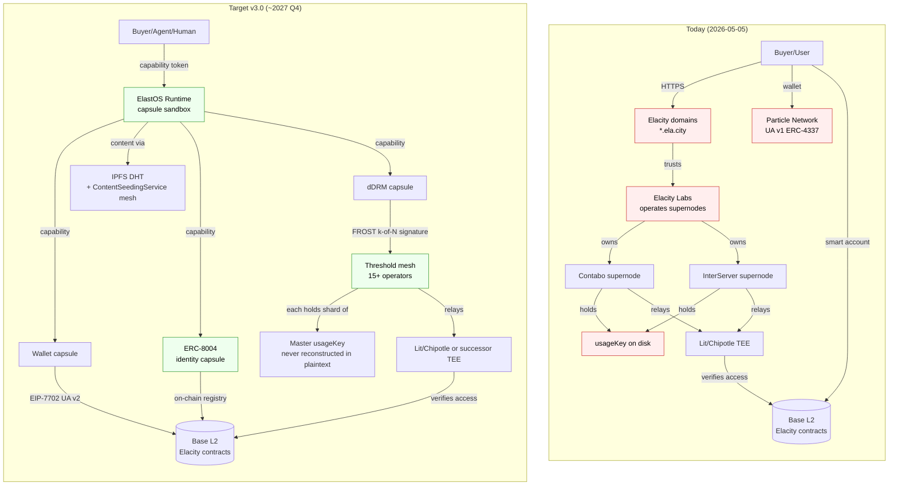
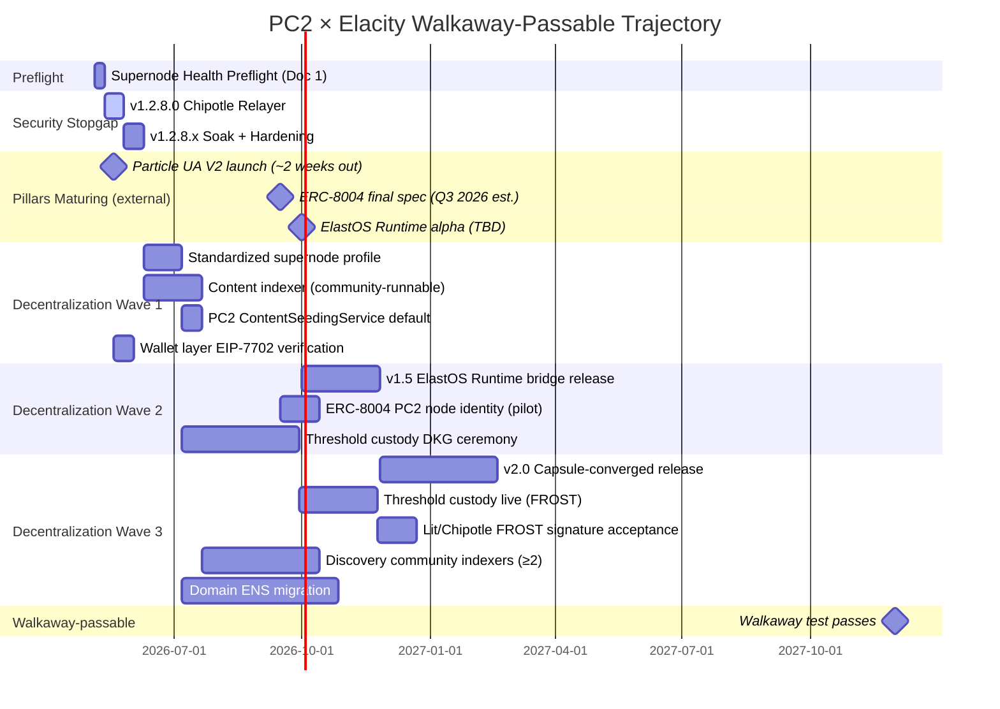

# PC2 × Elacity — Decentralization Trajectory

> **Purpose**: A forward-looking, opinionated, evidence-cited plan for moving PC2 + Elacity from "well-engineered centralized stack with credible decentralized claims" to a network that genuinely passes the walkaway test.
> **Audience**: Sasha (decisions), Irzhy (operations), Runtime convergence team, future PC2 contributors.
> **Created**: 2026-05-05
> **Status**: Draft (refreshed 2026-05-06 with post-preflight reality and post-Apr-26→May-6 release context) — pending Sasha sign-off on §7 open questions.
> **Companion docs**:
> - [`DECENTRALIZATION_STATUS.md`](./DECENTRALIZATION_STATUS.md) — what we built (history + inventory, last updated 2026-04-07)
> - [`ARCHITECTURE_CONVERGENCE.md`](./ARCHITECTURE_CONVERGENCE.md) — PC2 v1 vs ElastOS Runtime (deep technical convergence plan)
> - [`../handover/PC2_CONVERGENCE_INVENTORY_FOR_RUNTIME.md`](../handover/PC2_CONVERGENCE_INVENTORY_FOR_RUNTIME.md) — feature-by-feature mapping to capsules
> - [`../../.cursor/tasks/V1.2.8.0-CHIPOTLE-RELAYER/V1.2.8.0-CHIPOTLE-RELAYER.md`](../../.cursor/tasks/V1.2.8.0-CHIPOTLE-RELAYER/V1.2.8.0-CHIPOTLE-RELAYER.md) — current relayer task
> - [`../../.cursor/tasks/SUPERNODE-HEALTH-PREFLIGHT-V1280/SUPERNODE-HEALTH-PREFLIGHT-V1280.md`](../../.cursor/tasks/SUPERNODE-HEALTH-PREFLIGHT-V1280/SUPERNODE-HEALTH-PREFLIGHT-V1280.md) — preflight that this doc assumes is complete

---

## 0. Executive Summary

The PC2 × Elacity stack today is **a well-engineered centralized convenience layer wrapped around a decentralized core**. The core (Elacity smart contracts on Base, threshold decryption via Lit Protocol / Chipotle) is genuinely trustless. The convenience layer (two supernodes operated by Elacity Labs, Particle Network's smart-account infrastructure, Elacity's GraphQL indexer, the Pinata IPFS gateway, the Lit Action capacity-credit relayer) is decisively centralized.

**The walkaway test fails today.** If Elacity Labs disappeared this morning:
- The supernode mesh stops in days (SSL certs expire, no operator rotates them).
- The `usageKey` for Chipotle DRM is irretrievable from any non-Elacity location.
- The Particle wallet bridge becomes unmaintained as Particle's own roadmap shifts.
- The Elacity GraphQL indexer goes silent; no one can find anything.
- Existing buyers can still decrypt content they already own (Lit/Chipotle TEE keeps working) — but new purchases, new uploads, and new content discovery all stop.

**v1.2.8.0 (Chipotle relayer) does NOT improve this.** It closes the wire-leak of `usageKey` to PC2 nodes and instead recentralizes that custody onto Elacity-controlled supernodes. That's a security win (smaller attack surface) but a decentralization regression (more centralized custody). This trade is correct for now — but it should be named explicitly so we don't gaslight ourselves into thinking v1.2.8.0 makes the network more decentralized. **It doesn't.**

The good news: there is a credible 18-month path to walkaway-passable. It rests on three pillars that converge well:

1. **Particle Network's Universal Accounts V2** (EIP-7702, ~2 weeks out) — removes the smart-account migration cliff for users; same-address upgrade.
2. **ERC-8004 trustless agent registry** (Ethereum standard, draft → final 2026 Q3) — gives every PC2 node and AI agent a native on-chain identity that any other node/agent can verify without trusting Elacity Labs.
3. **ElastOS Runtime** (Rust, capability-token model, capsule sandboxes) — replaces the iframe-monolith app model, replaces session tokens with capability tokens, makes operator substitution structurally trivial.

When you compose all three, you get: any human or AI agent can run a PC2 node, register on-chain, accept capability-bounded tasks from other nodes, mint and sell content, and participate in DRM custody via threshold cryptography across N peers — without depending on Elacity Labs surviving. **That's the walkaway-passable network.**

This document is the sequenced 18-month plan to get there.

### Trust topology — today vs target



**The single most important migration**: from "Elacity Labs holds the `usageKey` on two boxes" → "no single party can hold or use the master key without coalition consent."

---

## 1. Verified Current State (2026-05-06 SSH audit, post-preflight)

The original 2026-05-05 audit lived in [`.cursor/tasks/SUPERNODE-HEALTH-PREFLIGHT-V1280/`](../../.cursor/tasks/SUPERNODE-HEALTH-PREFLIGHT-V1280/SUPERNODE-HEALTH-PREFLIGHT-V1280.md) and described a degraded state (InterServer Kubo SIGSEGV crash-loop, asymmetric mesh, runaway memory in `pc2-ipfs-relay`). **That preflight is now complete.** The 2026-05-06 read-only audit below reflects the current state both supernodes are in.

### Mesh topology (post-preflight)
- **2 supernodes**: Contabo (`38.242.211.112`, Ubuntu 20.04, 12c/47G) + InterServer (`69.164.241.210`, Ubuntu 24.04, 32c/91G). No new operators yet; onboarding `ipfs.ela.city` as a third peer is the next planned step (handover doc: [`docs/handover/ELACITY_IPFS_CLUSTER_ONBOARDING.md`](../handover/ELACITY_IPFS_CLUSTER_ONBOARDING.md), local-only — gitignored — sent via secure channel).
- **Cluster**: IPFS Cluster v1.1.4 on both, **Kubo v0.41.0 on both** (upgraded from v0.34.1 during preflight). CRDT replication, both peers see each other (`Sees 1 other peers`), pinset symmetric at **54 entries** (mostly operator metadata: channel covers, channel images, thumbnails, registry binaries, plan metadata). Cluster trust config is `trusted_peers: ["*"]` — operator onboarding is secret-gated, not per-peer ACL.
- **Supernode services** (systemd, both running):
  - Both: `pc2-kubo`, `pc2-cluster`, `pc2-ipfs-relay`, `pc2-web-gateway`, `pc2-boson`, `pc2-vless-reality`, `pc2-app-registry`.
  - Contabo additionally: ESC archive node (Elastos chain RPC).
  - InterServer additionally: `pc2-cloud-node`, `pc2-network-map`, full Elastos validator stack (`arbiter`, `esc`, `eid`, `eco`, `ela`).
- **DRM custody**: live `usageKey` still at `/root/pc2/web-gateway/ddrm-config.json` (mode 0644, root-owned) on **both** supernodes. Same prefix as the leaked one (`0jC5JTzx…`). **Rotation runbook present at [`.cursor/tasks/SEC-2026-04-28-WAVE8-CHIPOTLE-HARDENING/ROTATION_RUNBOOK.md`](../../.cursor/tasks/SEC-2026-04-28-WAVE8-CHIPOTLE-HARDENING/ROTATION_RUNBOOK.md); rotation not yet executed.** Wave 8 envelope-signing seed at `/etc/pc2/elacity-provision.ed25519` (mode 0600). v2 envelope responses from `/api/ddrm/provision` continue to verify correctly.

### Operational health (post-preflight)
- **InterServer Kubo**: healthy, 273 swarm peers, no SIGSEGV in 24 h+ (the boxo nil-deref bug was resolved by upgrading to Kubo 0.41.0).
- **Contabo Kubo**: healthy, no crashes.
- **Cluster mesh**: symmetric replication, 54 pins on each side. CRDT consensus operating normally.
- **`pc2-ipfs-relay`**: still leaks (upstream JS-libp2p connection-manager bug, not yet patched). Containment in place — a `MemoryMax=6G` systemd drop-in caps memory; the kernel SIGKILLs on cap, `Restart=always` brings it back. Live state 2026-05-06: Contabo 4.5 GB / 6 GB cap (will OOM-cycle within a day at current rate), InterServer 3.3 GB / 6 GB cap (slower leaker). The **cure code** (lower `maxConnections` to 256 + explicit `circuitRelayServer` caps) is in the working tree at `deploy/ipfs-relay/index.js` (uncommitted) but not yet deployed. After deploy, expected leak rate drops below the cap; capping stays as defense-in-depth.

### Asymmetry that remains (preflight didn't unify these)
- Contabo's nginx still has `/cluster-pin/` ingress (bearer-token + 30 r/m rate limit) for PC2 ContentSeedingService; InterServer does not. PC2 nodes have one valid HTTP receiver in the mesh.
- UFW posture differs: Contabo restricts cluster swarm 9096 to peer IP; InterServer relies on default DENY. Neither is wrong, but they're not the same template.
- These get standardized in the v1.3 supernode profile work (§6.1 Phase D).

### What this means for the trajectory
1. **The 2-supernode mesh is now stable, not brittle.** Replication is symmetric and CRDT consensus is healthy. The fragility came from operational state (crash loops, asymmetric mesh), not architecture.
2. **Adding a 3rd peer is the next decentralization step**, not a precondition. Onboarding `ipfs.ela.city` (handover doc above) takes the cluster 2 → 3 peers and crosses a credibility threshold: one peer in different infrastructure (GCP), operated by a related but distinct ops thread. Same template extends to community operators.
3. **The `usageKey` custody model is still fragile in a way the design docs don't fully reflect.** Both copies on disk, both root-owned, no rotation cadence, no threshold protection. v1.2.8.0 (Chipotle relayer) prevents *new* leakage; rotation closes the *current* leakage. Both items are in §3 of this doc.
4. **PC2 ContentSeedingService still has one valid HTTP receiver.** Standardizing the supernode profile so InterServer's nginx reaches parity with Contabo's is queued in §6.1 Phase D.

The four issues in the original preflight (Kubo crashes, mesh asymmetry, runaway memory, no symmetry plan) are operationally resolved. The remaining items are: (a) deploy the relay cure, (b) rotate the live `usageKey`, (c) onboard `ipfs.ela.city` to the cluster, (d) standardize the supernode profile so adding a 4th peer is template work. These are all in §6's roadmap.

---

## 2. The Decentralization Ladder (per-layer scoring)

Each row is a system layer. Each column is a verifiable property. The point is to be honest about which parts are decentralized, which are semi-decentralized (multi-operator but coordinated), and which are centralized (single operator, single point of failure).

| Layer | Property today | Walkaway-passable target | Status today | Status target |
|---|---|---|---|---|
| **Smart contracts (access, payment, mint)** | Deployed on Base (Ethereum L2), immutable, audited | Same — already passes | 🟢 **Decentralized** | 🟢 |
| **Lit Action code** | Pinned on IPFS (`QmVMgKMKFELHTZf8PmD58nYBhr4S5DHLpuwFTvyDKLPXgq`), immutable, content-addressed | Same — already passes | 🟢 **Decentralized** | 🟢 |
| **Threshold decryption** | Lit Protocol Chipotle (≥6 TEE nodes, MPC) | Either same, OR FROST-style threshold across PC2/supernode operators | 🟢 **Decentralized** (within Chipotle) | 🟢 |
| **DRM key custody (`usageKey`)** | Two on-disk copies, both Elacity-owned root, no rotation cadence | k-of-N FROST/MPC shards across ≥ 7 independent operators | 🔴 **Centralized** | 🟢 |
| **Supernode operation** | 2 supernodes, 1 operator (Elacity Labs), shared bearer tokens | ≥ 7 supernodes, ≥ 5 independent operators, per-node tokens, on-chain registry | 🔴 **Centralized** | 🟡→🟢 |
| **PC2 node identity** | Per-install local Boson DID + AppKit Web2 OAuth | ERC-8004 on-chain identity registry | 🟡 **Semi-decentralized** | 🟢 |
| **PC2 node app distribution** | Elacity-signed app registry, mirrored to supernodes | Same + reproducible builds + community-pinned mirrors | 🟡 **Semi-decentralized** | 🟢 |
| **Smart-account wallet** | Particle Network UA v1 (ERC-4337, custodial-ish via Particle MPC) | Particle UA v2 (EIP-7702, EOA upgrade, no migration) — better custody story | 🟡 **Semi-decentralized** | 🟢 |
| **Content storage (IPFS)** | Helia local + Cluster mesh + Pinata gateway + public DHT | Same minus Pinata dependency; ContentSeedingService active in client mesh | 🟡 **Semi-decentralized** | 🟢 |
| **Content delivery (gateways)** | Elacity gateway + Pinata + IPFS public gateways | Same + community-operated supernode gateways | 🟡 **Semi-decentralized** | 🟢 |
| **Content discovery (indexer)** | Elacity GraphQL (centralized service) | On-chain mint events as primary source + community indexers | 🔴 **Centralized** | 🟡→🟢 |
| **Content upload** | Elacity IPFS upload service (502s frequently per `ELACITY-IPFS-UPLOAD-502` task) | Direct-to-cluster pin via PC2 ContentSeedingService | 🔴 **Centralized** | 🟢 |
| **Lit capacity credits** | Elacity-owned RLI tokens delegated via Lit Relayer DB | Either same model with multiple delegators, OR each PC2 node holds own RLI | 🔴 **Centralized** | 🟡 |
| **App runtime (third-party apps)** | Iframe sandbox, browser-trust-boundary | ElastOS Runtime WASM capsules + capability tokens | 🟡 **Semi-decentralized** | 🟢 |
| **Domain (`*.ela.city`)** | Elacity-owned DNS, single registrar | Either ENS subdomain (`*.elacity.eth`) or community-handed-off DNS | 🔴 **Centralized** | 🟡 |
| **TLS certificates** | Elacity-managed Let's Encrypt + per-supernode self-signed | Per-operator ACME automation OR DANE/IPFS-native trust | 🔴 **Centralized** | 🟡 |
| **Update channel (PC2 binary)** | `scripts/update.sh` pulls from main branch | Same + community fork tolerance + ERC-8004-attested updates | 🟡 **Semi-decentralized** | 🟢 |

**Honest scoring**: 4 🟢 / 7 🟡 / 6 🔴 today. Target: 13 🟢 / 4 🟡 / 0 🔴.

The big-impact upgrades:
- **🔴 → 🟢 DRM key custody** is the single most important transition (§4.2).
- **🔴 → 🟡 Supernode operation** unlocks every other supernode-mediated service.
- **🔴 → 🟡 Discovery/upload** removes the most user-visible Elacity-Labs dependency.

---

## 3. What v1.2.8.0 Actually Does (and what it doesn't)

### What v1.2.8.0 fixes

The current PC2 dDRM flow leaks the live `usageKey` to every PC2 node that calls `/api/ddrm/provision`. The PC2 node then uses that key to call Chipotle directly. Three problems:
- Any compromised PC2 node can exfiltrate the key.
- Any malicious user can run a forked PC2 node that intercepts the key.
- Lit Protocol/Chipotle has no per-PC2-node accountability — all calls look identical.

v1.2.8.0 introduces a supernode-side relayer:
- PC2 nodes call `POST /api/ddrm/lit-action` on a supernode (SIWE-authenticated).
- Supernode forwards the request to Chipotle, **adds the `usageKey` server-side**, returns the response.
- The `usageKey` never crosses the wire.

This is a **clear security improvement**.

### What v1.2.8.0 does NOT do

It **recentralizes custody** of the `usageKey`. Today the key is on supernode disks AND on every PC2 node that ever called `/api/ddrm/provision`. After v1.2.8.0 the key is *only* on supernode disks. The supernodes become a hard dependency for any decryption that requires the master key.

This is the right trade for security. It is **not** a decentralization improvement. It is a decentralization regression that buys us time to do the actual decentralization (§4.2 — threshold custody).

**Stop telling ourselves v1.2.8.0 makes the network more decentralized.** It makes the network more securely centralized. Both can be true.

### Why this matters for the trajectory

If we don't acknowledge this honestly, we will:
1. Skip the threshold-custody work because "v1.2.8.0 already fixed it."
2. Build the next 6 months of features on top of the supernode-as-hard-dependency assumption, then have to refactor when we finally tackle threshold custody.
3. Lose the trust of the small number of users who actually understand the architecture.

The right framing is: **v1.2.8.0 is the security stopgap that makes the threshold-custody migration safe to do.** Without v1.2.8.0, threshold custody would be migrating a leaky system into a new shape; with v1.2.8.0, threshold custody migrates a contained system.

---

## 4. The Walkaway Test — honest answer

> **Walkaway test**: If Elacity Labs disappears tomorrow, can the network keep functioning, can users keep using it, can new operators replace Labs without privileged access?

### 4.1 — Today's answer (brutal)

| Component | If Labs disappears |
|---|---|
| Smart contracts on Base | ✅ Continue working forever |
| Lit Action code on IPFS | ✅ Continues to be content-addressable; nodes that pinned it keep serving |
| Existing AccessTokens | ✅ Holders can decrypt indefinitely (Lit/Chipotle TEE works) |
| New encryption operations | ❌ Encryption requires `usageKey` → only on Labs supernodes → fails |
| New decryption operations | ❌ Same |
| New mints | ⚠️ Possible if user has direct contract access, but no UI to do so without Elacity GraphQL/Market |
| Content discovery | ❌ Elacity GraphQL goes silent; no fallback indexer |
| Content upload | ❌ Elacity IPFS upload service stops; users can run own Helia but no path to cluster |
| Supernode mesh | ❌ SSL certs expire, no operator rotates them; nginx eventually returns 526 |
| PC2 node updates | ❌ `scripts/update.sh` pulls from `pc2.net` repo; if Labs's GitHub goes, no updates |
| New PC2 node installs | ❌ AppKit OAuth depends on Labs; supernodes serve app-registry |

**Pass rate**: 3 of 11 components survive. **Fail rate**: 8 of 11. **The walkaway test fails decisively today.**

### 4.2 — The single biggest unlock: threshold custody of `usageKey`

The `usageKey` problem is the keystone. If we solve it, several other 🔴s become 🟢s automatically:

**Threshold-custody design (FROST/Shamir, k-of-N)**:
- Master `usageKey` is generated once via distributed key generation (DKG) ceremony among N (≥ 7) supernode operators.
- Each operator holds 1/N of the key shard. **No single operator can reconstruct the key.**
- To sign a Chipotle API call, k of N (e.g., 5 of 7) operators participate in a FROST signing round. The signature is verifiable by Chipotle as if it came from a single canonical key — but no single operator can produce it alone.
- Operator failure = degraded threshold (4 of 6, etc.) but service continues.
- Operator compromise = no leak, since shard alone is useless.

**Why FROST and not Shamir alone**: Shamir reconstructs the secret on a single machine, briefly. FROST signs without ever reconstructing — the signing operation is itself threshold-distributed. For DRM key custody, FROST is the right primitive.

**Migration path (from v1.2.8.0 hub-and-spoke to threshold-custody)**:
1. (~v1.3.0) Add a second supernode signing key (existing Wave 8 envelope key + a new Chipotle-relayer signing key). Both supernodes co-sign relayer responses.
2. (~v1.5.0) DKG ceremony generates master shards across the full supernode operator set (≥ 5 operators).
3. (~v1.7.0) Migrate Chipotle's accepted signing key from the single Labs-operated key to the threshold-derived key. This requires Lit Protocol / Chipotle to accept FROST-style signatures, which is a roadmap item for them already.
4. (~v2.0) Decommission the single-operator path entirely.

**This is the keystone work.** Everything else in the trajectory is in service of getting to a state where the threshold-custody migration is safe to do.

### 4.3 — Other 🔴 → 🟡 unlocks

- **Content discovery (Elacity GraphQL)**: Build community-runnable indexer that consumes Base mint events directly. Reference impl: a thin Node service that subscribes to `Channel.Minted` events, indexes into local SQLite, exposes GraphQL. PC2 nodes can either run their own or query a community-operated peer's. Requires no Elacity Labs cooperation. **Effort**: ~3-week project, fits in v1.5.x.
- **Content upload**: Replace Elacity's IPFS upload service with PC2 ContentSeedingService → cluster-pin path (which already exists; needs to be made the default after [SUPERNODE-HEALTH-PREFLIGHT-V1280](../../.cursor/tasks/SUPERNODE-HEALTH-PREFLIGHT-V1280/SUPERNODE-HEALTH-PREFLIGHT-V1280.md) standardizes the supernode profile).
- **Domain (`*.ela.city`)**: Migrate to ENS subdomain pattern (`<username>.elacity.eth` resolved via ENS gateway). Already-installed PC2 nodes already have IPFS gateway addressing; this is mostly a discovery-layer migration.

### 4.4 — Walkaway-passable definition

The network passes the walkaway test when:

- [ ] **DRM**: ≥ 5 of 7 operators can produce a valid Chipotle API signature without coordinating with Elacity Labs.
- [ ] **Operations**: ≥ 5 supernode operators run independent infrastructure with the standardized profile.
- [ ] **Discovery**: ≥ 2 community-operated indexers running, reachable via PC2 node fallback.
- [ ] **Upload**: PC2 nodes can mint+upload+seed content without contacting any Elacity-Labs-operated service.
- [ ] **Identity**: PC2 nodes register on-chain via ERC-8004 (no Elacity OAuth dependency).
- [ ] **Updates**: PC2 nodes can update from a community fork if Elacity's GitHub is unavailable (mirrored release artifacts on IPFS, signed by ≥ 2 of 3 maintainers).

When all 6 boxes tick, we declare walkaway-passable. Realistic target: **2027 Q4** (~18 months from this doc).

---

## 5. The Three-Pillar Convergence

Three external technologies are arriving at roughly the right time. Composing them is what makes the walkaway-passable network possible without an unrealistic amount of from-scratch work.

### 5.1 — Pillar 1: Particle Network Universal Accounts V2 (EIP-7702)

**What it is**: EIP-7702 allows an EOA to be temporarily upgraded to a smart account at signing time, without changing the address or migrating assets. Particle's UA v2 delivers this as a transparent UX upgrade.

**What changes for PC2**:
- Today's UA v1 (ERC-4337) requires users to have a separate smart-account address with funds bridged to it. Particle has just announced (~2 weeks out) that they will deprecate the v1 smart accounts; users will be asked to withdraw funds and re-onboard.
- UA v2 is same-address: a user's MetaMask EOA *becomes* the smart account at txn time. No fund migration. No new address. No re-onboarding.

**Implication for PC2's trust model**:
- The address that holds an `AccessToken` (which the Lit Action verifies via `hasAccessByContentId`) is the same EOA the user has always used. Buyer-address propagation logic in the Market app simplifies.
- **Particle remains in the trust path for transaction submission UX** — they're still the bundler/paymaster. But the user's address is no longer Particle-derived; it's a self-custodied EOA.
- This is a meaningful 🔴 → 🟡 transition for the wallet layer, and a real reduction in surface area.

**What we need to do**:
- Verify the existing Market app's buyer-address detection (`AGENT_ACCOUNT_ARCHITECTURE.md` cites the smart-account-aware path) handles EIP-7702 EOAs correctly. Particle has stated "in theory should all just work" — verify, don't trust.
- Update `pc2-node` wallet handling to recognize EIP-7702-upgraded EOAs as access-token holders. Likely a no-op since the on-chain check is `balanceOf(<address>)` regardless of account type.
- Communicate the Particle deprecation to users in-app (1-week banner ~T-3 days).
- **Don't preemptively migrate users.** Particle's roadmap is theirs to execute; we just track and verify.

**Risk**: Particle's UA v2 launch slips. Manageable — UA v1 keeps working in the meantime.

### 5.2 — Pillar 2: ERC-8004 Trustless Agent Registry

**What it is**: A draft Ethereum standard for on-chain registration, discovery, trust attestation, and verification of AI agents (and, by extension, any autonomous-or-semi-autonomous network participant). Three core registries on-chain:
- **Identity Registry**: agent-name → owner-address mapping.
- **Reputation Registry**: signed attestations from one agent about another.
- **Validation Registry**: cryptographic proof that an agent's output meets a stated property (zk-proof, TEE attestation, etc.).

**What changes for PC2**:
- Today, a PC2 node's identity is local: a Boson DID + AppKit OAuth handle. Other nodes/agents can't verify a PC2 node's identity without trusting Elacity's AppKit.
- With ERC-8004, every PC2 node (and every AI agent acting as a PC2 node — which is the long-term goal) has a globally-resolvable on-chain identity. Other agents can read the on-chain reputation and validation history without trusting any centralized service.

**Implication for the agent economy**:
- A PC2 node operated by a human and a PC2 node operated by an AI agent become structurally identical from the network's perspective. Both have on-chain identities. Both can mint, sell, buy, attest, verify.
- This is the substrate for the "agents trading data globally where rights are traded and respected" vision. Without ERC-8004, every agent-to-agent interaction has to rely on Elacity Labs as the trust anchor. With ERC-8004, the trust is on-chain.

**What we need to do**:
- Pilot integration in v2.x: a PC2 node optionally publishes its identity to ERC-8004 on first run. Users sign once with their wallet to register the node; the on-chain entry persists.
- Add validation-registry hooks for content provenance: when a PC2 node mints content, it can also publish a validation-registry attestation that links the mint to a verified upstream source.
- Add reputation-registry hooks for buyer-seller trust signals: after a successful purchase, the buyer can sign a reputation attestation about the seller.

**Risk**: ERC-8004 final spec slips beyond 2026 Q3. Manageable — the draft is stable enough to build against; final spec changes will be small.

### 5.3 — Pillar 3: ElastOS Runtime (capability tokens, capsules)

**What it is**: A Rust-based minimal kernel for personal computing. Everything runs inside sandboxes (WASM capsules or Firecracker VMs). All inter-capsule access is gated by **capability tokens** — cryptographically-signed, scoped, time-limited tokens that replace the session-token / API-key model.

**What changes for PC2**:
- Today, PC2 is a Node.js monolith. Third-party apps run as iframes (security boundary = browser same-origin policy). Inter-service auth = bearer tokens that can be exfiltrated and replayed.
- Under the Runtime, third-party apps run as WASM capsules with declared capabilities. A capsule asking for "network access to api.chipotle.litprotocol.com" gets a capability token scoped to that exact origin, with explicit expiry. The kernel logs every capability invocation. **Replay attacks become structurally impossible** — capabilities are per-invocation, not per-session.

**Implication for DRM custody**:
- The supernode-side `usageKey` access becomes a **capability** rather than a privilege of being root on the supernode. Even Elacity Labs operators don't have plaintext access; they hold capability tokens that are usage-bounded and audit-logged.
- The threshold-custody migration (§4.2) becomes simpler: each shardholder holds a *capability* to participate in FROST signing rounds, scoped to specific public-key contexts and rate-limited. The kernel enforces.

**What we need to do**:
- v1.5 bridge release: PC2 + ElastOS Runtime co-installed, with PC2 features available as capsules through the Runtime's app shell. (Tracked in `CAPSULE-RUNTIME-WASM` task.)
- v2.0 converged release: PC2 features fully ported to capsules; Node.js monolith deprecated.
- v2.5+: capability-token model extends to inter-PC2-node auth, replacing JWTs and bearer tokens.

**Risk**: ElastOS Runtime delivery timeline. This is the hardest dependency to estimate. Mitigation: every roadmap milestone before v1.5 should be deliverable with the existing PC2 v1 stack alone, so a Runtime slip doesn't block walkaway-test progress.

### 5.4 — Composing the three

Each pillar individually is useful. The composition is what unlocks the walkaway-passable network:

| Walkaway-passable property | Without three pillars | With three pillars |
|---|---|---|
| Anyone can run a PC2 node | Possible but no on-chain identity → can't be discovered or trusted by other nodes | ERC-8004 identity → discoverable + reputation-tracked |
| Agents (human or AI) interchangeable | Needs custom auth model per agent | Capability tokens + ERC-8004 identity → uniform |
| DRM custody distributed | Requires building threshold-crypto from scratch | Runtime capability tokens model → FROST shardholders are just a special capsule type |
| Wallet layer self-custodied | Requires user to migrate to a non-Particle wallet | EIP-7702 → user's existing EOA upgrades transparently |
| New operator can substitute Labs | Asymmetric supernode setup work | Supernode profile + capability tokens → drop-in operator onboarding |

The composition is also why this trajectory takes ~18 months: we have to wait for the pillars to mature before we can fully compose them. The interim work (v1.2.8.0 → v1.3 → v1.5) is what we do *while* the pillars mature.

---

## 6. Sequenced Roadmap

The roadmap is opinionated about ordering. Each milestone has a fixed dependency on the prior milestone — you can't skip to threshold custody without standardized supernodes, you can't standardize supernodes without fixing the current health issues.



### 6.1 — Phase-by-phase

#### Phase A: Preflight (next 1 week)
- [ ] **[SUPERNODE-HEALTH-PREFLIGHT-V1280](../../.cursor/tasks/SUPERNODE-HEALTH-PREFLIGHT-V1280/SUPERNODE-HEALTH-PREFLIGHT-V1280.md)** — fix the 4 production issues, standardize the supernode profile.

Gate to next phase: cluster mesh sees 1 peer from both directions, pin propagation < 30s, both supernodes pass `/api/ddrm/provision` v2 envelope check.

#### Phase B: Security stopgap (weeks 2-5)
- [ ] **v1.2.8.0** — Chipotle relayer (already designed, [task here](../../.cursor/tasks/V1.2.8.0-CHIPOTLE-RELAYER/V1.2.8.0-CHIPOTLE-RELAYER.md)). Closes wire-leak. Does not improve decentralization. Acknowledged honestly.
- [ ] **v1.2.8.1** — soak: 14 days of production traffic with the relayer; track error budget; rate-limit tuning.
- [ ] **v1.2.8.2** — relayer envelope-signing parity (every relayer response Ed25519-signed by the supernode, verified by PC2 node).

Gate to next phase: zero `usageKey` references in PC2 node response payloads or logs.

#### Phase C: Pillars start landing
- **Particle UA V2 launches** (~2 weeks out per their announcement). Verification work in `WALLET-EIP7702-VERIFICATION` task (to be created when timing is clearer).
- **ERC-8004 spec finalizes** (Q3 2026, external dependency). Until then, design integrations against the draft.
- **ElastOS Runtime alpha** (TBD, external dependency).

#### Phase D: Decentralization Wave 1 (months 2-5)

Things we can do TODAY without waiting for any external pillar:

- [ ] **Standardized supernode profile** (`SUPERNODE-PROFILE-STANDARD-V13`). Outcome: a 1-page operator runbook + Ansible/Docker Compose package that any operator can run to onboard a new supernode in < 1 day, fully symmetric to existing supernodes. Includes:
  - nginx config template (with `/api/ddrm/provision`, `/api/ddrm/lit-action`, `/cluster-pin/`, `/api/health` endpoints baked in)
  - UFW rule template (per-peer cluster swarm allowlist)
  - Cluster join procedure (CRDT consensus mode, peer discovery)
  - Bearer-token rotation runbook (per-node tokens, not shared mesh-wide)
- [ ] **Community-runnable content indexer** (`COMMUNITY-INDEXER-V13`). A thin GraphQL service that subscribes to Base `Channel.Minted` and `AccessToken.Transfer` events, indexes into local SQLite, exposes the same query shape as Elacity's GraphQL. Run by anyone, including PC2 node operators. Reference deployment: dockerized.
- [ ] **PC2 ContentSeedingService becomes default** (`PC2-SEEDING-DEFAULT-V13`). Once 2+ supernodes accept `/cluster-pin/`, change the PC2 default to use the seeding path and deprecate the Elacity IPFS upload service for PC2-native uploads.
- [ ] **Wallet layer EIP-7702 verification** (`WALLET-EIP7702-VERIFICATION-V13`, after Particle UA v2 launches). Verify the existing buyer-address propagation handles EIP-7702 EOAs. Add explicit test cases.

Gate to next phase: ≥ 1 supernode operated by someone other than Elacity Labs, indexer + seeding default deployed, wallet layer verified.

#### Phase E: Decentralization Wave 2 (months 5-10)

- [ ] **v1.5 ElastOS Runtime bridge release**. PC2 + Runtime co-installed. PC2 features delivered as capsules through Runtime's app shell. Detailed plan in [`ARCHITECTURE_CONVERGENCE.md`](./ARCHITECTURE_CONVERGENCE.md).
- [ ] **ERC-8004 PC2 node identity (pilot)** (`ERC8004-IDENTITY-PILOT-V15`). Optional on-chain identity registration during PC2 first-run. User signs once. Identity entries tested against external verifiers.
- [ ] **Threshold custody DKG ceremony** (`THRESHOLD-CUSTODY-DKG-V15`). First operational DKG ceremony among ≥ 5 supernode operators. Generates the first FROST-shareable `usageKey-equivalent`. Run as a dry-run against a non-production Chipotle key.

Gate to next phase: DKG-derived key validated (test signing rounds successful), ≥ 3 supernode operators independent of Elacity Labs.

#### Phase F: Decentralization Wave 3 (months 10-18)

- [ ] **v2.0 capsule-converged release**. Node.js monolith deprecated; everything runs as capsules under Runtime. Detailed in [`ARCHITECTURE_CONVERGENCE.md`](./ARCHITECTURE_CONVERGENCE.md).
- [ ] **Threshold custody live (FROST signing in production)** (`THRESHOLD-CUSTODY-LIVE-V17`). Production Chipotle calls signed via FROST k-of-N round.
- [ ] **Lit/Chipotle FROST signature acceptance** (external dependency). Lit Protocol accepts FROST-derived signatures as equivalent to single-key signatures.
- [ ] **Discovery: ≥ 2 community indexers operational**.
- [ ] **Domain ENS migration** (`DOMAIN-ENS-MIGRATION-V20`). Move from `*.ela.city` DNS to `*.elacity.eth` ENS subdomains.

Gate: walkaway-passable acceptance criteria (§4.4) all green.

### 6.2 — What's in v1.3, v1.4 (the stuff between v1.2.8.x and v1.5)?

Glad you asked — this gap is where most of Phase D's work lives. Tracked separately so it doesn't get lost:

- v1.3.0: standardized supernode profile + per-node bearer tokens + nginx symmetry
- v1.3.x: relayer rate-limit tuning, observability, error-budget dashboard
- v1.4.0: community indexer reference + PC2 ContentSeedingService default + EIP-7702 verification
- v1.4.x: pilot ERC-8004 identity registration (optional flag)

---

## 7. Open Questions for Sasha (with recommended answers)

Six decisions needed before this trajectory is binding. Each has a recommended answer + alternatives + what shifts elsewhere in the plan if you pick differently.

### Q1: Is the walkaway-passable target (§4.4) the right target?

**Recommended answer**: YES, with the 6-criterion definition as written.

**Alternative A**: Stronger target — also require zero-knowledge content-provenance proofs and reproducible PC2 node builds. **Shifts**: timeline to ~24 months instead of 18; adds a §4.4(7) and §4.4(8) box.

**Alternative B**: Weaker target — drop the "≥ 5 operators independent of Labs" criterion, replace with "operationally feasible to substitute Labs." **Shifts**: timeline to ~12 months but the resulting "walkaway-passable" claim is much weaker and possibly indefensible.

### Q2: Is Lit/Chipotle the right DRM substrate for the long term, or is it an interim?

**Recommended answer**: INTERIM. Plan to migrate to a fully-decentralized DRM substrate (post-2027) once threshold-custody work has matured. Reasons: Chipotle is operated by Lit Protocol (a single organization), uses a closed TEE network, and depends on Lit's own roadmap. Even with FROST custody on our side, we still depend on Lit's continued operation.

**Alternative A**: Stick with Lit/Chipotle indefinitely; bet on Lit's own decentralization. **Shifts**: drops a major v3.0 work item; adds external dependency risk.

**Alternative B**: Migrate to a fully-self-hosted threshold-decryption mesh post-v2.0 (PC2 nodes themselves participate in threshold decryption). **Shifts**: adds 12+ months of cryptography work (BLS signatures, MPC for re-encryption, etc.); but is the only path to true zero-Labs operation.

### Q3: How aggressive should we be about deprecating Elacity GraphQL / IPFS upload service?

**Recommended answer**: SOFT DEPRECATION. Keep Elacity Labs services running indefinitely for legacy clients. Default new PC2 nodes to the community indexer + ContentSeedingService starting v1.4. After 12 months of soft deprecation, hard deprecate.

**Alternative A**: Hard deprecate at v1.4 — anyone using legacy services gets a banner saying "this service is going away in 30 days." **Shifts**: faster decentralization win but bumps every existing user.

**Alternative B**: Never deprecate — Elacity services run forever as the default; community alternatives exist as opt-in. **Shifts**: walkaway test never strictly passes; we've built decentralization but not adopted it.

### Q4: How do we handle the existing user base when Particle UA v2 lands and Particle deprecates UA v1?

**Recommended answer**: PARTICLE-DRIVEN MIGRATION. Particle has stated they'll handle the migration (their request: "users withdraw funds from the smart account"). PC2 layers a 1-week banner alerting users, plus a "verify your address still works after Particle's migration" check. We don't initiate the migration ourselves.

**Alternative A**: Pre-emptive migration — PC2 prompts users to withdraw before Particle even announces a hard date. **Shifts**: alarming UX for users who weren't asked; risk of jumping the gun.

**Alternative B**: No coordination — let users figure it out. **Shifts**: bad UX, possible support load.

### Q5: Should we self-host an indexer that competes with Elacity GraphQL, or coordinate with Elacity to open-source theirs?

**Recommended answer**: SELF-HOST. Build a minimal-viable competitor. Then offer the Elacity team to merge our community indexer with their existing GraphQL service if they want. This is more politically diplomatic if we already have a working indexer.

**Alternative A**: Coordinate first — ask Elacity to open-source. **Shifts**: depends on them; can't proceed if they decline.

**Alternative B**: Don't build a competitor — Elacity GraphQL is the indexer forever. **Shifts**: doesn't pass walkaway test, drops a §4.4 criterion.

### Q6: Is the 18-month walkaway-passable target realistic given the dependencies on ElastOS Runtime, ERC-8004, and Particle?

**Recommended answer**: REALISTIC IF WE TRACK SLIPS HONESTLY. The 18-month estimate assumes:
- Particle UA V2 ships within 4 weeks (their stated timeline)
- ERC-8004 final spec lands by 2026 Q4 (currently draft)
- ElastOS Runtime alpha lands by end-2026 (no public timeline)
- Threshold-custody DKG ceremony succeeds first try

Each of these has slip risk. The mitigation is that **Phase D (Decentralization Wave 1) doesn't depend on any of them** — we can ship months 2-5 of work on PC2 v1 alone. So slips push out the walkaway-passable date but don't block interim progress.

**Alternative A**: 12-month target — drop scope on ElastOS Runtime convergence. **Shifts**: walkaway-passable is achievable on PC2 v1 alone, but the resulting network is much harder to build the agent economy on.

**Alternative B**: 24-month target — be conservative about all external dependencies. **Shifts**: more honest but might lose narrative momentum.

---

## Appendix A: Particle Universal Accounts V2 Migration

Particle has stated (per user's recent communication):
- UA v1 (ERC-4337) smart accounts will be deprecated.
- They will ask users to withdraw funds from the v1 smart accounts.
- UA v2 (EIP-7702) launches in approximately 1-2 weeks.
- Users' existing EOA addresses will be transparently upgradeable at signing time, no migration needed.
- "In theory should all just work" — but verification is our responsibility.

### What we control
- Verifying buyer-address detection in `pc2-node` and the Market app correctly handles EIP-7702-upgraded EOAs (likely no-op since on-chain checks are address-based regardless of account type).
- Communicating the UA v1 deprecation to users in-app via a 1-week banner ahead of Particle's stated date.
- Providing a "verify your address still works" check after Particle's migration — a one-shot smoke test in the Market app that confirms the user can still decrypt content they own.

### What we don't control
- Particle's actual migration timeline (could slip).
- Whether EIP-7702 transaction support is universally available on Base (Coinbase, MetaMask, WalletConnect each have their own rollout pace).
- Whether v1 smart accounts that hold AccessTokens but no funds will somehow be left orphaned (Particle has said no, but verify).

### Risk mitigation
- During the migration window, PC2 nodes should accept access checks against EITHER the EOA address OR a known-derived smart-account address. Existing buyer-address detection should be made tolerant to both modes during the transition.
- Add a feature flag `WALLET_DUAL_ADDRESS_MODE=1` that enables this dual-mode lookup; default ON during migration, default OFF after Particle declares migration complete.

### What this means for §6's roadmap
Phase D's `WALLET-EIP7702-VERIFICATION-V13` task is the home for this work. It's small (~1 week) and gated on Particle UA v2 actually launching. If Particle slips, this task slips with no impact on other work.

---

## Appendix B: Verified Supernode State Snapshot (2026-05-06, post-preflight)

This is the raw data the trajectory is built on. Captured via read-only SSH audit on 2026-05-06 (post-preflight). The original 2026-05-05 snapshot — describing the SIGSEGV crash loop, asymmetric mesh, and runaway memory — is preserved in [`.cursor/tasks/SUPERNODE-HEALTH-PREFLIGHT-V1280/`](../../.cursor/tasks/SUPERNODE-HEALTH-PREFLIGHT-V1280/SUPERNODE-HEALTH-PREFLIGHT-V1280.md). **All secrets redacted.**

### Contabo (38.242.211.112)

```
Host:        vmi1330656.contaboserver.net
OS:          Ubuntu 20.04, kernel 5.4.x
Hardware:    12 cores, 47 GiB RAM, 785 GB disk (39% used)
Uptime:      142 days, 8:15
Load avg:    9.06 / 9.12 / 9.14   (busy but not pegged; ESC validator stack contributes)

Services running (systemd, all active):
  pc2-kubo               (Kubo 0.41.0, healthy)
  pc2-cluster            (IPFS Cluster v1.1.4, sees 1 other peer ✓)
  pc2-ipfs-relay         (PID 1333883, 4.5 GB RSS / 6 GB MemoryMax cap, 1d 3h since last restart)
  pc2-web-gateway        (slim gateway, healthy)
  pc2-boson              (Boson DHT supernode)
  pc2-vless-reality      (VLESS proxy)
  pc2-app-registry       (PC2 App Registry mirror)
  ESC archive node       (Elastos chain RPC, port 20636)

Kubo:
  Version:     0.41.0   (upgraded from 0.34.1 during preflight)
  Peer ID:     12D3KooWQZu8rY8BgD1fLq1yF1ArSnUy9D3Jf71w7C6RpbZy9nVr   (unchanged across upgrade)
  Status:      healthy

Cluster:
  Version:     1.1.4
  Peer ID:     12D3KooWJuGc9wSpyWZh3yHbcCxmpC9aujKzUwcWT86RVv31m4UW
  Sees:        1 other peer (InterServer) ✓
  Pinset:      54 entries (was 43 pre-preflight)

pc2-ipfs-relay containment:
  Drop-in:     /etc/systemd/system/pc2-ipfs-relay.service.d/memory-cap.conf
  Cap:         MemoryMax=6G
  Behaviour:   kernel SIGKILL on cap; Restart=always brings back; ~24h cycle on Contabo
  Cure:        deploy/ipfs-relay/index.js (working tree, NOT YET DEPLOYED):
                 maxConnections 512 → 256
                 explicit circuitRelayServer caps (maxInboundHopStreams=64, etc.)
                 expected: leak rate drops below cap; capping stays as defense-in-depth

dDRM config (/root/pc2/web-gateway/ddrm-config.json):
  Mode:        0644, root-owned
  Schema:      version 2 (Wave 8 envelope)
  Network:     chipotle
  apiUrl:      https://api.chipotle.litprotocol.com
  usageKey:    <REDACTED, prefix 0jC5JTzx — same as the leaked one; rotation pending>
  pkpId:       0x68dcf3dc3c38d726e8a7cdca8ab318f49552c05d
  authority:   0x09dBe796f40ECEffEAccf243c3d758C4c1d8D87D
  chain:       base (chainId 8453)
  rpc:         https://mainnet.base.org
  actions:     [mediaDecrypt, mediaEncrypt, nonMediaDecrypt, nonMediaEncrypt]

Ed25519 envelope-signing seed:
  Path:        /etc/pc2/elacity-provision.ed25519
  Size:        32 bytes
  Mode:        0600, root-owned ✓

Live /api/ddrm/provision response:
  HTTP:        200, ~782 bytes
  Schema:      {v: number, domain: string, signedAt: number, payload: object, sig: string} ✓
```

### InterServer (69.164.241.210)

```
Host:        elacity.hostname.com
OS:          Ubuntu 24.04, kernel 6.8.x
Hardware:    32 cores, 91 GiB RAM, 3.6 TB disk (22% used)
Uptime:      208 days, 5:10
Load avg:    0.85 / 1.33 / 1.36   (light)

Services running (systemd, all active):
  pc2-kubo               (Kubo 0.41.0, healthy — was crash-looping pre-preflight)
  pc2-cluster            (IPFS Cluster v1.1.4, sees 1 other peer ✓ — was restart-looping pre-preflight)
  pc2-ipfs-relay         (PID 2852832, 3.3 GB RSS / 6 GB MemoryMax cap, 1d 3h since last restart)
  pc2-web-gateway        (gateway code — pc2-gateway on :443/:80, same code as Contabo's slim gateway)
  pc2-boson              (Boson DHT supernode)
  pc2-vless-reality      (VLESS proxy)
  pc2-cloud-node         (PC2 Cloud Auth Gateway Node)
  pc2-app-registry       (PC2 App Registry)
  pc2-network-map        (PC2 Network Map)

Elastos validator stack (NOT PC2):
  arbiter, pg, esc, eid, eco, ela
  + multiple chain-specific RPC ports

Kubo:
  Version:     0.41.0   (upgraded from 0.34.1 during preflight; SIGSEGV crash loop resolved)
  Peer ID:     12D3KooWFLBeemSpue43SULYbqmSrgreYDYQdfDKD2MHUnRcMc5f   (unchanged)
  Status:      healthy, 273 swarm peers

Cluster:
  Version:     1.1.4
  Peer ID:     12D3KooWPpBC7v6smm5eHv5yx45rfE3xzk5k3srnGu8Dg9Jgjyw6
  Sees:        1 other peer (Contabo) ✓
  Pinset:      54 entries (CRDT-replicated, matches Contabo)

pc2-ipfs-relay containment:
  Same MemoryMax=6G drop-in as Contabo. Same cure pending.
  Slower leaker than Contabo (~10–14 day cycle vs ~24h).

nginx asymmetry (unchanged from preflight findings):
  No /api/ddrm/, no /cluster-pin/ on InterServer's nginx — the gateway code
  serves /api/* paths directly via pc2-web-gateway (Node on :443).
  Contabo's nginx has both routes. PC2 ContentSeedingService /cluster-pin/
  receivers: 1 (Contabo only). Standardization queued in v1.3 supernode profile work.

UFW:
  ports 22, 80, 443, 8443, 8090, 51820-51821, 39001, 25000-30000 — open
  port 9096 NOT explicitly restricted — relies on UFW default DENY for incoming
  (Contabo restricts 9096 to peer IP 38.242.211.112; InterServer doesn't.)

dDRM config:
  Same schema and value-shape as Contabo. usageKey REDACTED (same prefix as leaked).

Ed25519 envelope-signing seed:
  Same shape as Contabo ✓
```

### Mesh-level observations (post-preflight)

```
Cluster CRDT replication:
  Configured:  --replication-min 2 --replication-max 2
  Actual:      both peers report 54 PINNED, identical CIDs. Replication symmetric. ✓

Pin propagation Contabo↔InterServer:
  Live and bidirectional. Sample CIDs include channel-image.png, thumbnail.jpg,
  channel-cover.png, plan-metadata.json, pc2-node-bafybeic… (registry binary).

Stale alerts:
  Both peers carry one health alert from 2026-05-05 (peer-ping expired during the
  preflight upgrade window, never cleared). Cosmetic — peers see each other live now.

ContentSeedingService receivers:
  Contabo:     /cluster-pin/ ✓ (bearer-token + 30 r/m)
  InterServer: missing — same gap as preflight noted; queued for v1.3 supernode profile work.

Cluster trust config:
  trusted_peers: ["*"]  — secret-gated CRDT membership; no per-peer ACL.
  Implication:  adding ipfs.ela.city as a 3rd peer is a deploy operation
                (cluster-service install + secret + bootstrap config), not a code
                change. See docs/handover/ELACITY_IPFS_CLUSTER_ONBOARDING.md.

Operators: Elacity Labs (single operator for both supernodes today).
           ipfs.ela.city onboarding pending → would make 1 op for 2 boxes
           + 1 op for 1 box = "related but distinct ops thread" not full
           operator independence yet, but template for community operators is set.
```

---

## Appendix C: Cross-doc map

Where each topic in this trajectory is covered in other docs:

| Topic in this doc | Other docs that go deeper |
|---|---|
| §1 Verified state | [`SUPERNODE-HEALTH-PREFLIGHT-V1280`](../../.cursor/tasks/SUPERNODE-HEALTH-PREFLIGHT-V1280/SUPERNODE-HEALTH-PREFLIGHT-V1280.md) (raw evidence + fix plan), [`SYSTEM_MAP.md`](../SYSTEM_MAP.md) (architecture overview), [`../../.cursor/tasks/SUPERNODE-CLUSTER-SETUP/SUPERNODE-CLUSTER-SETUP.md`](../../.cursor/tasks/SUPERNODE-CLUSTER-SETUP/SUPERNODE-CLUSTER-SETUP.md) (original setup) |
| §2 Decentralization ladder | [`DECENTRALIZATION_STATUS.md`](./DECENTRALIZATION_STATUS.md) (longer-form per-component scoring as of 2026-04-07) |
| §3 v1.2.8.0 critique | [`../../.cursor/tasks/V1.2.8.0-CHIPOTLE-RELAYER/V1.2.8.0-CHIPOTLE-RELAYER.md`](../../.cursor/tasks/V1.2.8.0-CHIPOTLE-RELAYER/V1.2.8.0-CHIPOTLE-RELAYER.md) (the design doc itself) |
| §4 Threshold custody | [`CHIPOTLE_HANDOVER.md`](./CHIPOTLE_HANDOVER.md), [`CHIPOTLE_MIGRATION_RESEARCH.md`](./CHIPOTLE_MIGRATION_RESEARCH.md) |
| §5.1 Particle UA V2 | [`AGENT_ACCOUNT_ARCHITECTURE.md`](./AGENT_ACCOUNT_ARCHITECTURE.md), [`AGENT_ACCOUNT_STRATEGY.md`](./AGENT_ACCOUNT_STRATEGY.md) |
| §5.2 ERC-8004 | [`ARCHITECTURE_CONVERGENCE.md`](./ARCHITECTURE_CONVERGENCE.md) §ERC-8004 section |
| §5.3 ElastOS Runtime | [`ARCHITECTURE_CONVERGENCE.md`](./ARCHITECTURE_CONVERGENCE.md) (deep dive), [`../../.cursor/tasks/CAPSULE-RUNTIME-WASM/CAPSULE-RUNTIME-WASM.md`](../../.cursor/tasks/CAPSULE-RUNTIME-WASM/CAPSULE-RUNTIME-WASM.md) (capsule task), [`CAPSULE_COMPATIBILITY.md`](./CAPSULE_COMPATIBILITY.md), [`../handover/PC2_CONVERGENCE_INVENTORY_FOR_RUNTIME.md`](../handover/PC2_CONVERGENCE_INVENTORY_FOR_RUNTIME.md) (feature mapping) |
| §6 Roadmap | [`../../.cursor/plans/Roadmap.md`](../../.cursor/plans/Roadmap.md) (existing roadmap; this doc supersedes for the decentralization-specific track) |

---

## Final note: tone-honesty

This document deliberately doesn't soft-pedal what's centralized today. Two reasons:

1. **The audience knows the difference.** Sasha + Irzhy + the maintainer team can tell when a decentralization claim is real and when it's marketing. Honesty here is the only sustainable mode.
2. **The plan is more credible when the starting point is acknowledged honestly.** "We have 6 🔴 layers, and here's how we get to 0 🔴" is a stronger story than "we're already mostly decentralized, here are some polish items."

The end goal — a network where humans and agents are interchangeable participants, where DRM custody is genuinely distributed, where Elacity Labs's continued existence is no longer a load-bearing assumption — is achievable. The trajectory above is one credible path. It is not the only path. It is the path I'd recommend if I had to commit.

Decisions on the §7 questions unblock the remaining detail. Once those are answered, this doc stops being a draft.

---

**End of document. Last updated 2026-05-06 (post-preflight, post-v1.2 + v1.2.7.7 → v1.2.7.13 hot-patch cycle).**
